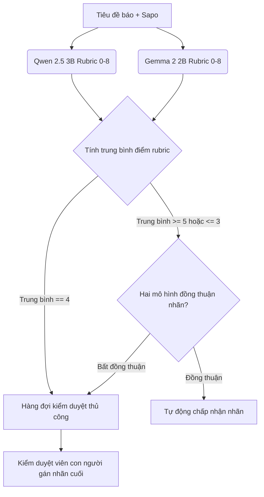
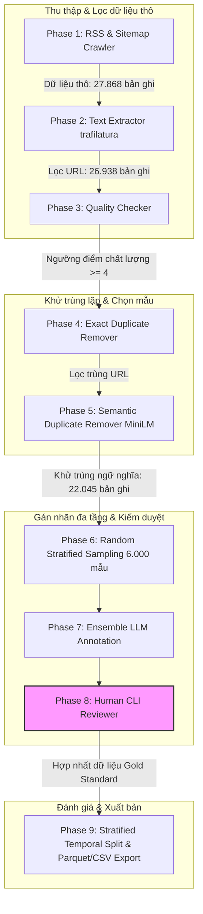

# Bộ dữ liệu phát hiện tiêu đề báo điện tử clickbait tiếng Việt

[](https://huggingface.co/datasets/tnghuy/DS108-Clickbait)
[](https://creativecommons.org/licenses/by/4.0/)
[](https://opensource.org/licenses/MIT)
[](https://www.python.org/)
[](https://www.docker.com/)

Kho lưu trữ này chứa một pipeline xây dựng hoàn chỉnh, phục vụ bài toán xây dựng bộ dữ liệu phát hiện tiêu đề báo điện tử clickbait tiếng Việt quy mô **6.000 mẫu tin tức**. Bộ dữ liệu được thu thập từ 6 trang báo điện tử phổ biến tại Việt Nam và được gán nhãn thông qua nhóm mô hình ngôn ngữ lớn (LLM) song hành chạy local (Qwen 2.5 3B + Gemma 2 2B) kết hợp chấm điểm theo tiêu chí rubric 4 chiều và sự kiểm duyệt nghiêm ngặt của con người (Human-in-the-loop).

---

## 1. Động lực

Tin giật gân (clickbait) trực tuyến hiện là một vấn đề nhức nhối trên các báo điện tử Việt Nam. Clickbait bóp méo thông tin, gây nhiễu loạn truyền thông và làm giảm nghiêm trọng trải nghiệm của độc giả. Mặc dù bài toán phát hiện clickbait đã được nghiên cứu rộng rãi trên thế giới, việc áp dụng tại Việt Nam vẫn gặp rào cản lớn: **Đặc thù ngôn ngữ Việt:** Tiếng Việt có tính ẩn ý cao, sử dụng từ ngữ đa nghĩa, chơi chữ và cấu trúc ngữ pháp biến đổi linh hoạt, đòi hỏi các mô hình phải có khả năng hiểu ngữ cảnh sâu sắc thay vì chỉ dựa vào các từ khóa giật gân thô.

Dự án này được thiết lập nhằm xây dựng một pipeline hoàn chỉnh và phát hành bộ dữ liệu clickbait tiếng Việt chất lượng cao đầu tiên cung cấp chi tiết điểm số rubric đa tiêu chí cho cộng đồng nghiên cứu mã nguồn mở.

---

## 2. Đặc điểm nổi bật

* **Thu thập đa nguồn:** Quy trình tự động thu thập tin tức từ 6 trang báo điện tử lớn đại diện cho các phong cách viết báo khác nhau tại Việt Nam (nhóm tin giải trí/xã hội vs. tin chính luận).
* **Kiểm định chất lượng trích xuất:** Lọc văn bản nghiêm ngặt qua 6 tiêu chí chất lượng (loại bỏ code HTML thừa, đảm bảo độ dài tối thiểu, cấu trúc câu hợp lệ).
* **Khử trùng lặp ngữ nghĩa:** Áp dụng mô hình embedding sâu `paraphrase-multilingual-MiniLM-L12-v2` để loại bỏ tiêu đề trùng lặp ngữ nghĩa (semantic duplicate) trên toàn bộ kho dữ liệu.
* **Gán nhãn Ensemble Rubric & Human-in-the-Loop:** Sử dụng hai LLMs cục bộ đánh giá độc lập theo rubric 4 tiêu chí clickbait riêng biệt. Các trường hợp biên và bất đồng thuận được giải quyết triệt để bởi kiểm duyệt viên con người.
* **Thực nghiệm Baseline hoàn chỉnh:** Tích hợp sẵn mã nguồn huấn luyện các mô hình baseline từ Machine Learning truyền thống (TF-IDF + LR/SVM) tới Deep Learning (PhoBERT Feature Extraction) được tối ưu hóa siêu tham số bằng Optuna.
* **Đóng gói chuyên nghiệp:** Quản lý phụ thuộc đồng nhất với Poetry, hỗ trợ container hóa Docker & Docker Compose, và kiểm thử hệ thống tự động qua `pytest`.

---

## 3. Cấu trúc bộ dữ liệu & Thống kê

Bộ dữ liệu hoàn chỉnh bao gồm **6.000 mẫu** tiêu đề và sapo báo điện tử tiếng Việt đã được phân chia ngẫu nhiên có kiểm soát thời gian (Stratified Temporal Split) nhằm tránh rò rỉ thông tin từ tương lai vào quá khứ:

* **Tập huấn luyện (Train):** 4.212 mẫu (70.2%)
* **Tập phát triển (Validation):** 894 mẫu (14.9%)
* **Tập kiểm thử (Test):** 894 mẫu (14.9%)

Dữ liệu được xuất bản dưới 3 định dạng phổ biến trong thư mục `data/final/`: CSV (`.csv`), JSON Lines (`.jsonl`), và Apache Parquet (`.parquet`).

### Thống kê phân bố theo nguồn báo và nhãn

| Nguồn Báo (Domain) | Số lượng mẫu | Tỉ lệ nhãn Clickbait | Thống kê đặc trưng nguồn tin |
| :--- | :---: | :---: | :--- |
| **afamily.vn** | 1.000 | 53.4% | Trang tin gia đình, phụ nữ; tỉ lệ clickbait cao nhất |
| **kenh14.vn** | 1.000 | 50.2% | Báo giải trí, đời sống giới trẻ; tỉ lệ clickbait rất cao |
| **soha.vn** | 1.000 | 35.6% | Trang tổng hợp tin tức nhanh; xu hướng giật gân trung bình cao |
| **thanhnien.vn** | 1.000 | 4.9% | Báo chính luận xã hội lớn; tỉ lệ clickbait thấp |
| **tuoitre.vn** | 1.000 | 4.5% | Báo chính luận lớn; giữ tính khách quan cao, tỉ lệ clickbait thấp |
| **nhandan.vn** | 1.000 | 0.2% | Cơ quan ngôn luận chính thống; tỉ lệ clickbait cực kỳ thấp |
| **Tổng cộng** | **6.000** | **24.8%** | **Trung bình toàn bộ bộ dữ liệu** |

### Từ điển dữ liệu (Data Dictionary)

Mỗi bản ghi dữ liệu chứa các trường thông tin chính được cấu trúc chi tiết phục vụ cả bài toán phân loại nhị phân và phân tích chuyên sâu:

| Trường dữ liệu | Kiểu dữ liệu | Mô tả |
| :--- | :--- | :--- |
| `id` | string | Định danh duy nhất toàn hệ thống của bản ghi dữ liệu |
| `title` | string | Tiêu đề bài báo tiếng Việt (đối tượng phân loại chính) |
| `sapo` | string | Đoạn mở đầu / tóm tắt bài báo (cung cấp ngữ cảnh bổ sung) |
| `body_preview` | string | 500 ký tự đầu tiên của thân bài viết (dùng kiểm tra tính bất tương đồng) |
| `url` | string | Đường dẫn liên kết gốc của bài viết phục vụ truy vết dữ liệu |
| `source` | string | Tên miền nguồn tin báo chí (nhận diện nguồn bài viết) |
| `publish_date` | string | Ngày xuất bản bài viết theo định dạng chuẩn ISO 8601 |
| `final_label` | float | Nhãn clickbait cuối cùng: **0 = non-clickbait, 1 = clickbait** |
| `confidence` | float | Độ tin cậy gán nhãn [0.0, 1.0] dựa trên sự đồng thuận và nguồn duyệt |
| `rubric_total` | int | Tổng điểm tiêu chí rubric trung bình của hai mô hình LLM (0-8) |
| `quality_score` | int | Điểm chất lượng trích xuất văn bản (dao động từ 4 đến 6) |
| `human_verified` | bool | Đã được kiểm duyệt và chỉnh sửa thủ công bởi con người hay chưa |
| `split` | string | Phân tập dữ liệu: `train` / `validation` / `test` |

> [!NOTE]
> Báo cáo chi tiết và tài liệu hướng dẫn sử dụng nhanh theo chuẩn Hugging Face nằm tại [dataset_card.md](file:///d:/UIT/DS108/projectfn/data/final/dataset_card.md) (hoặc file [README.md của thư mục data/final](file:///d:/UIT/DS108/projectfn/data/final/README.md)), và từ điển dữ liệu đầy đủ nằm tại [data_dictionary.md](file:///d:/UIT/DS108/projectfn/docs/data_dictionary.md).

### Sử dụng dữ liệu nhanh với Python Pandas
Người dùng chỉ muốn tải và phân tích dữ liệu nhanh có thể đọc trực tiếp định dạng Parquet (nhẹ và giữ nguyên schema dữ liệu):
```python
import pandas as pd

# Đọc tập dữ liệu huấn luyện
df_train = pd.read_parquet("data/final/train.parquet")
print(f"Kích thước tập Train: {df_train.shape}")
print(df_train[["title", "final_label"]].head())
```

---

## 4. Phương pháp gán nhãn & Kiểm soát chất lượng

Nhãn dữ liệu được xác định thông qua sự kết hợp giữa **Trí tuệ nhân tạo (Dual-LLM Ensemble)** và **Trí tuệ con người (Human-in-the-loop)**.



### Tiêu chí Rubric Đánh giá Clickbait
Mỗi tiêu đề được hai mô hình local Qwen 2.5 3B và Gemma 2 2B đánh giá độc lập trên 4 tiêu chí cốt lõi, mỗi tiêu chí nhận điểm từ 0 (không xuất hiện), 1 (xuất hiện một phần) đến 2 (xuất hiện hoàn toàn):
* **C1 - Phóng đại cảm xúc (Sensationalism):** Sử dụng các tính từ mạnh, cường điệu hóa hoặc dấu câu cực đoan (!!!, ???) nhằm giật gân.
* **C2 - Khoảng trống thông tin (Information Gap):** Cố ý ẩn đi chủ từ, hành động hoặc kết quả cốt lõi để kích thích tò mò.
* **C3 - Định khung cú pháp (Syntactic Framing):** Dùng câu lệnh áp đặt hành vi đọc giả hoặc câu hỏi tu từ kích thích click.
* **C4 - Tính bất tương đồng (Incongruence):** Nội dung tiêu đề không khớp, phóng đại quá mức hoặc mâu thuẫn trực tiếp với phần sapo/thân bài viết.

*Chi tiết các ví dụ đối lập cho từng tiêu chí có thể xem tại [annotation_guideline.md](file:///d:/UIT/DS108/projectfn/docs/annotation_guideline.md).*

### Quy trình Kiểm duyệt Thủ công & Nghịch lý Kappa
* **Kiểm duyệt thủ công:** Tổng cộng **3.968 trường hợp biên và bất đồng thuận** (chiếm 66.13% dữ liệu) đã được các kiểm duyệt viên con người trực tiếp rà soát và gán nhãn thủ công bằng công cụ CLI reviewer, tạo lập nên tập dữ liệu chuẩn vàng (Gold Standard).
* **Độ thỏa thuận (IAA):** Cohen's Kappa giữa hai mô hình đạt **0.0598 (Slight agreement)** và Fleiss' Kappa (tính trên 3 rater: Qwen, Gemma và con người) đạt **-0.2689** (được tính trên phân tập 5.995 mẫu có đầy đủ nhãn phản hồi từ cả hai mô hình LLM, loại bỏ 5 mẫu bị lỗi/thiếu nhãn trong quá trình gọi API local).
* **Nghịch lý Kappa (Kappa Paradox):** Chỉ số Kappa âm hoặc gần 0 là biểu hiện kinh điển của Nghịch lý Kappa (Feinstein & Cicchetti, 1990) do sự lệch ngưỡng gán nhãn cực đoan giữa hai mô hình: Qwen 2.5 3B cực kỳ khắt khe (chỉ gán nhãn clickbait cho 9.1% dữ liệu) trong khi Gemma 2 2B cực kỳ cởi mở (gán nhãn clickbait cho 74.2% dữ liệu). Việc đưa con người vào kiểm duyệt toàn bộ các trường hợp lệch ngưỡng này đã giúp giải quyết triệt để thiên lệch của mô hình LLM.

---

## 5. Kiến trúc Pipeline xử lý dữ liệu

Quy trình kỹ nghệ dữ liệu từ lúc thu thập tin tức thô cho đến khi xuất bản các tập Parquet được tự động hóa qua 9 giai đoạn:



---

## 6. Thực nghiệm & Kết quả Baseline

Để đánh giá tính khả thi thực nghiệm của bộ dữ liệu, chúng tôi đã tiến hành huấn luyện và so sánh hiệu năng của 5 mô hình baseline khác nhau trên tập dữ liệu đã được xuất bản.

### Mô tả mô hình thực nghiệm
1. **Dummy Classifier:** Bộ phân loại cơ sở luôn dự đoán lớp đa số (`non-clickbait`), dùng làm mốc so sánh tối thiểu.
2. **Logistic Regression (TF-IDF):** Sử dụng các n-gram từ ngữ (unigrams và bigrams) kết hợp thuật toán hồi quy Logistic. Tham số phạt hồi quy $C$ được tối ưu hóa tự động bằng Optuna.
3. **SVM (TF-IDF):** Sử dụng bộ phân loại SVM tuyến tính (`LinearSVC`) kết hợp trích xuất đặc trưng TF-IDF và điều chỉnh siêu tham số bằng Optuna.
4. **Logistic Regression (PhoBERT):** Sử dụng mô hình transformer tiếng Việt **PhoBERT-base-v2** để trích xuất embedding câu (thực hiện tách từ tiếng Việt bằng thư viện PyVi kết hợp cơ chế mean pooling trên các token ẩn). Huấn luyện bộ phân loại hồi quy Logistic trên vector embedding này.
5. **SVM (PhoBERT):** Huấn luyện bộ phân loại SVM tuyến tính trên vector đặc trưng trích xuất từ PhoBERT.

*Tất cả các thử nghiệm ML/DL đều sử dụng chiến lược Stratified K-Fold (5 folds) trên tập huấn luyện để điều chỉnh siêu tham số.*

### Bảng kết quả hiệu năng mô hình (Đánh giá trên tập Test)

Bảng dưới đây trình bày chi tiết các chỉ số hiệu năng của các mô hình baseline trên tập kiểm thử độc lập (trích xuất từ [baseline_results.json](file:///d:/UIT/DS108/projectfn/logs/baseline_results.json)):

| Phương pháp Baseline | Vector đặc trưng | Độ chính xác (Accuracy) | F1-score lớp Clickbait | Macro F1-score |
| :--- | :--- | :---: | :---: | :---: |
| **Dummy (Baseline)** | Lớp đa số | 75.28% | 0.00% | 42.95% |
| **Logistic Regression** | TF-IDF (N-grams 1-2) | 79.08% | 63.26% | 74.32% |
| **SVM (LinearSVC)** | TF-IDF (N-grams 1-2) | 78.86% | 62.43% | 73.86% |
| **Logistic Regression** | **PhoBERT-base-v2 (Mean-Pooling)** | **81.99%** | **68.24%** | **77.84%** |
| **SVM (LinearSVC)** | PhoBERT-base-v2 (Mean-Pooling) | 81.54% | 67.96% | 77.50% |

### Phân tích Khoa học & Đánh giá Lỗi
* **Sức mạnh ngữ cảnh của PhoBERT:** Các mô hình sử dụng PhoBERT vượt trội rõ rệt so với mô hình TF-IDF truyền thống (~3% Accuracy và ~5% F1-score lớp clickbait). Điều này chứng minh rằng việc nắm bắt ngữ cảnh cú pháp tiếng Việt đóng vai trò quyết định trong phát hiện clickbait, vì nhiều tiêu đề clickbait không dùng từ khóa giật gân lộ liễu mà lạm dụng cấu trúc cú pháp ẩn ý (Information Gap).
* **Thử thách từ lớp Clickbait:** Điểm F1-score lớp clickbait cao nhất hiện tại dừng lại ở mức **68.24%** (so với Accuracy tổng thể 81.99%). Điều này phản ánh độ khó thực tế của bộ dữ liệu do tính nhập nhằng cao giữa clickbait và tiêu đề báo thông thường giàu tính thu hút, mở ra không gian nghiên cứu lớn cho các phương pháp fine-tuning end-to-end sâu hơn.
* **Phân tích lỗi (Error Analysis):** Các lỗi dự đoán sai phổ biến (lưu tại [error_analysis.json](file:///d:/UIT/DS108/projectfn/logs/error_analysis.json)) chỉ ra rằng mô hình dễ dự đoán nhầm (False Positive) các tiêu đề báo chứa trích dẫn lời phát ngôn của nhân vật, hoặc bỏ sót (False Negative) các tiêu đề clickbait sử dụng phép so sánh ẩn dụ phức tạp.

---

## 7. Hướng dẫn chạy nhanh & Tái lập kết quả

### Cài đặt môi trường

Dự án hỗ trợ cài đặt thông qua **Poetry** (quản lý phụ thuộc chặt chẽ) hoặc **pip**:

#### Cách A: Sử dụng Poetry (Khuyên dùng)
```bash
# Cài đặt thư viện phụ thuộc và thiết lập package
poetry install

# Kích hoạt môi trường ảo
poetry shell
```

#### Cách B: Sử dụng pip
```bash
pip install -r requirements.txt
```

> [!WARNING]
> **Lưu ý về phiên bản PyTorch CUDA:** Tệp cấu hình dependencies mặc định thiết lập PyTorch với CUDA 11.8 (`pytorch-cu118`). Nếu máy tính của bạn không có GPU Nvidia hoặc đang chạy phiên bản CUDA khác, vui lòng chỉnh sửa tệp `pyproject.toml` (dòng 29 và 52-55) hoặc cài đặt PyTorch phiên bản CPU tương ứng trước khi chạy bước trích xuất PhoBERT:
> `pip install torch --index-url https://download.pytorch.org/whl/cpu`

#### Cách C: Sử dụng Docker & Docker Compose (Khuyên dùng cho chạy cô lập)

Giải pháp Docker giúp đóng gói toàn bộ ứng dụng, thư viện Python, dịch vụ Ollama và tự động tải các mô hình ngôn ngữ lớn để gán nhãn mà không cần cài đặt phức tạp trên máy vật lý.

##### 1. Kiến trúc dịch vụ (Services Architecture)
Hệ thống sử dụng Docker Compose bao gồm 3 container liên kết nội bộ:
* **`clickbait-ollama`**: Chạy server Ollama cục bộ. Dữ liệu mô hình được lưu trữ bền vững qua Docker Volume `ollama_storage`.
* **`clickbait-ollama-pull`**: Container phụ trợ tự động khởi chạy để kiểm tra và tải xuống các mô hình gán nhãn (`qwen2.5:3b-instruct-q4_K_M` và `gemma2:2b-instruct-q4_K_M`) trực tiếp từ thư viện Ollama, sau đó tự động tắt khi hoàn thành.
* **`clickbait-pipeline-app`**: Môi trường chạy code chính dựa trên Python 3.12, ánh xạ mã nguồn cục bộ vào container thông qua volume mount và kết nối với server Ollama nội bộ qua địa chỉ `http://ollama:11434`.

##### 2. Khởi chạy toàn bộ hệ thống
Để xây dựng các container và tải các mô hình tự động:
```bash
# Xây dựng và khởi động tất cả dịch vụ trong nền
docker compose up -d --build
```
> [!NOTE]
> Quá trình tải các mô hình ở lần chạy đầu tiên có thể mất từ 5 - 15 phút tùy thuộc vào tốc độ mạng của bạn. Bạn có thể kiểm tra tiến trình tải bằng lệnh:
> ```bash
> docker logs -f clickbait-ollama-pull
> ```

##### 3. Các lệnh điều phối dự án thông dụng với Docker
Sau khi các dịch vụ đã khởi chạy thành công (`Up` status), bạn có thể trực tiếp thực thi các tác vụ bên trong môi trường container của `app`:

* **Chạy toàn bộ pipeline xử lý dữ liệu (`main.py`):**
  ```bash
  docker compose exec app python main.py --run-all
  ```
* **Chạy kiểm định chất lượng hoặc các bước lọc chọn lọc:**
  ```bash
  # Ví dụ chỉ chạy bước khử trùng lặp (step 4) và khử trùng ngữ nghĩa (step 5)
  docker compose exec app python main.py --step 4 --step 5
  ```
* **Huấn luyện và đánh giá các Baseline Models:**
  ```bash
  docker compose exec app python -m src.evaluation.baseline_models
  ```
* **Chạy thủ công toàn bộ suite kiểm thử (Unit Tests):**
  ```bash
  docker compose exec app pytest
  ```

##### 4. Cấu hình tăng tốc phần cứng với GPU Nvidia (Tùy chọn)
Mặc định Ollama chạy trong container sẽ thực hiện suy luận trên CPU (tốc độ chậm khi gán nhãn). Để tăng tốc bằng GPU, bạn cần đảm bảo máy vật lý đã cài đặt **NVIDIA Container Toolkit** và cấu hình thêm phần `deploy` cho dịch vụ `ollama` trong file [docker-compose.yml](file:///d:/UIT/DS108/projectfn/docker-compose.yml) như sau:

```yaml
  ollama:
    image: ollama/ollama:latest
    container_name: clickbait-ollama
    ports:
      - "11434:11434"
    volumes:
      - ollama_storage:/root/.ollama
    networks:
      - clickbait-network
    restart: unless-stopped
    # Thêm cấu hình deploy thiết bị GPU dưới đây:
    deploy:
      resources:
        reservations:
          devices:
            - driver: nvidia
              count: all
              capabilities: [gpu]
```
Sau khi chỉnh sửa cấu hình, khởi động lại container bằng lệnh: `docker compose up -d --build`.

##### 5. Tắt hệ thống
Để giải phóng tài nguyên và dừng toàn bộ các container:
```bash
docker compose down
```

---

### Sử dụng Trình điều phối chính (Orchestrator main.py)

Thay vì chạy từng script đơn lẻ bằng tay, dự án cung cấp tệp điều phối trung tâm [main.py](file:///d:/UIT/DS108/projectfn/main.py) giúp quản lý và thực thi pipeline một cách đồng bộ.

```bash
# Xem danh sách tất cả các bước của pipeline
python main.py --list-steps

# Chạy toàn bộ pipeline từ Phase 1 đến Phase 10
python main.py --run-all

# Chạy chọn lọc một hoặc nhiều bước cụ thể (Ví dụ: bước 4 Khử trùng lặp và bước 5 Khử trùng ngữ nghĩa)
python main.py --step 4 --step 5
```

Các bước được định nghĩa cụ thể trong orchestrator:
* `[01]` RSS/Sitemap Crawling (Thu thập tin thô)
* `[02]` Article Text Extraction (Trích xuất thân bài báo)
* `[03]` Quality Validation Scoring (Kiểm định chất lượng văn bản)
* `[04]` Exact Deduplication (Khử trùng lặp URL)
* `[05]` Semantic Deduplication (Khử trùng ngữ nghĩa sâu)
* `[06]` Ensemble LLM Annotation (Gán nhãn LLM song hành)
* `[07]` Ensemble Review Merging & Export Gate (Hợp nhất dữ liệu sau kiểm duyệt)
* `[08]` IAA & EDA Visualization (Tính toán độ tương đồng và vẽ biểu đồ EDA)
* `[09]` Train/Val/Test Split & Exporter (Chia tập stratified và xuất bản)
* `[10]` Dataset Card & Datasheet Generation (Sinh tài liệu hướng dẫn)
* `[11]` Run Unit Test Suite (Chạy bộ kiểm định Pytest)

---

### Chạy huấn luyện và đánh giá Baseline Models

Để tái lập kết quả huấn luyện mô hình ML Baseline và sinh tệp kết quả so sánh:

```bash
# Thực hiện huấn luyện các mô hình Baseline (Dummy, LR, SVM, PhoBERT)
python -m src.evaluation.baseline_models
```

* **Cơ chế Cache:** Lệnh trên sẽ tự động tính toán đặc trưng PhoBERT cho toàn bộ các mẫu dữ liệu và lưu cache tại `data/final/.phobert_cache.npz`. Trong các lần chạy tiếp theo, mô hình sẽ tải trực tiếp từ tệp cache để tối ưu hóa thời gian chạy (chỉ mất dưới 5 giây để hoàn thành toàn bộ quá trình).
* Tệp so sánh kết quả chi tiết sẽ được tự động xuất ra tại [baseline_results.json](file:///d:/UIT/DS108/projectfn/logs/baseline_results.json) và báo cáo phân tích lỗi định tính tại [error_analysis.json](file:///d:/UIT/DS108/projectfn/logs/error_analysis.json).

---

## 8. Hướng dẫn Đạo đức & Giới hạn dữ liệu

### Cân nhắc Đạo đức (Ethical Considerations)
* **Quyền riêng tư:** Bộ dữ liệu chỉ thu thập tiêu đề và đoạn tóm tắt (sapo) bài viết đã được các tòa soạn báo công bố công khai trên Internet. Hệ thống không thu thập bất kỳ thông tin định danh cá nhân (PII) nào của tác giả hoặc độc giả.
* **Bản quyền & Chính sách sử dụng hợp lý (Fair Use):** Nội dung bài báo được lưu trữ và phân tích hoàn toàn phục vụ cho mục đích nghiên cứu học thuật phi thương mại, tuân thủ nguyên tắc Fair Use trong khai thác dữ liệu nghiên cứu NLP.

### Giới hạn đã biết của bộ dữ liệu (Limitations)
1. **Thiên lệch nguồn tin (Source Bias):** Dữ liệu giới hạn trong 6 nguồn báo lớn của Việt Nam. Clickbait trên mạng xã hội (Facebook, TikTok) hoặc các trang tin tức tự do chưa được bao phủ và có thể có đặc điểm ngôn ngữ rất khác.
2. **Thiên lệch thời gian (Temporal Bias):** Toàn bộ dữ liệu được thu thập trong tháng 06/2026. Bộ dữ liệu có thể không bao quát được sự thay đổi của clickbait gắn liền với các mùa sự kiện lớn (ví dụ: bầu cử, giải đấu thể thao lớn).
3. **Sự mất cân bằng lớp:** Phân bố lớp clickbait chiếm 24.8% phản ánh thực tế phân bố tin tức tự nhiên nhưng đòi hỏi các mô hình ML/DL khi huấn luyện phải áp dụng các kỹ thuật cân bằng lớp (như class weighting).

### Phạm vi Sử dụng Khuyến nghị & Không Khuyến nghị
* **Khuyến nghị sử dụng (Intended Use):** Nghiên cứu thuật toán phát hiện tin giả, tin giật gân tiếng Việt; benchmarking năng lực hiểu ngữ cảnh của LLMs đối với tiếng Việt.
* **Không khuyến nghị sử dụng (Out-of-scope Use):** Sử dụng trực tiếp để chặn tin bài hoặc kiểm duyệt tự động trên hệ thống production của các tòa soạn báo mà không có sự giám sát hoặc phê duyệt cuối cùng từ biên tập viên con người.

---

## 9. Giấy phép sử dụng (License)

Dự án áp dụng chính sách giấy phép mở kép nhằm khuyến khích cộng đồng phát triển:
* **Mã nguồn (Source Code):** Được phát hành theo giấy phép **MIT License**. 
* **Bộ dữ liệu xuất bản (Dataset):** Được phát hành theo giấy phép **Creative Commons Attribution 4.0 International (CC-BY-4.0)**. 


