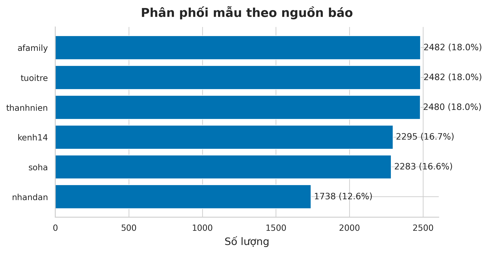
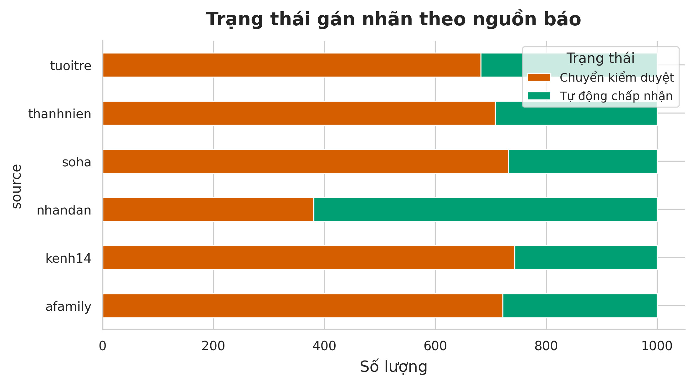
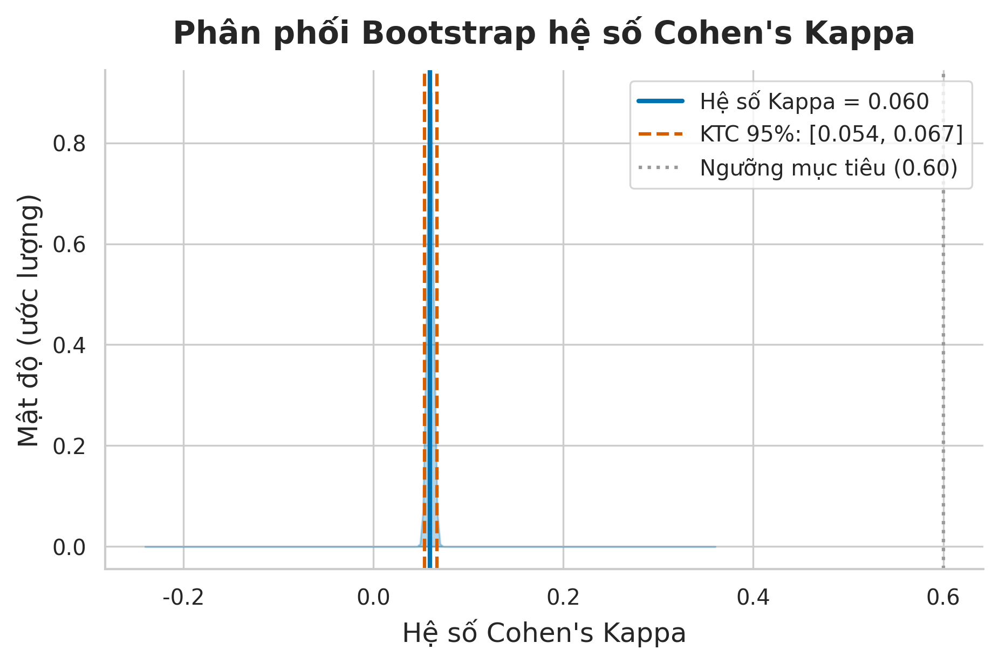
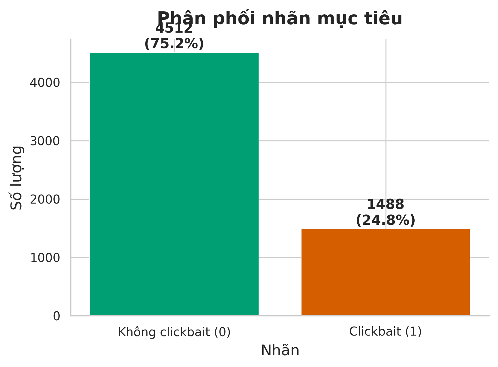
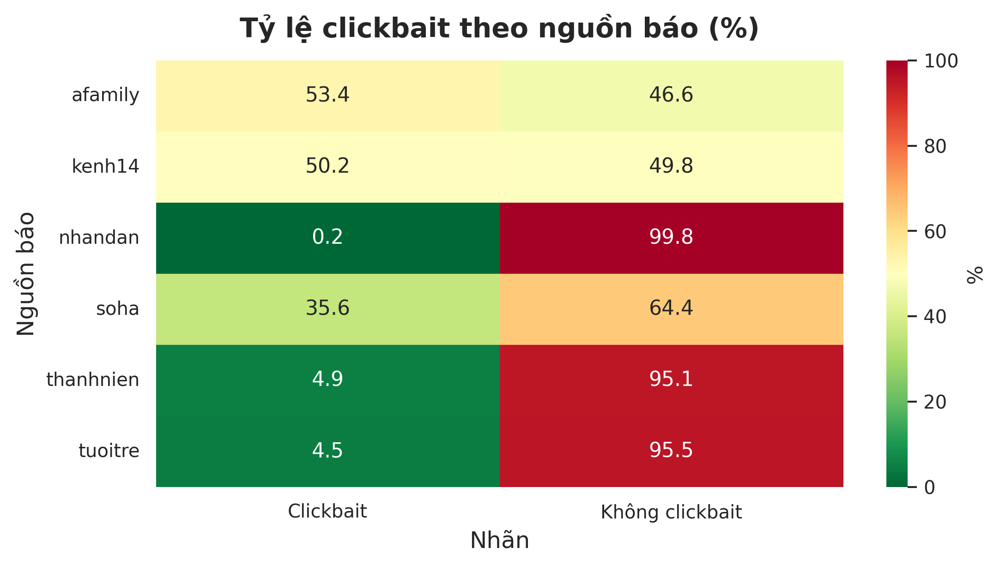
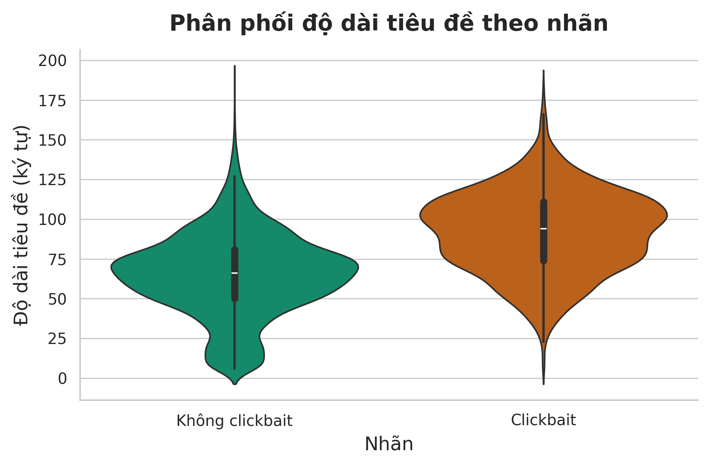
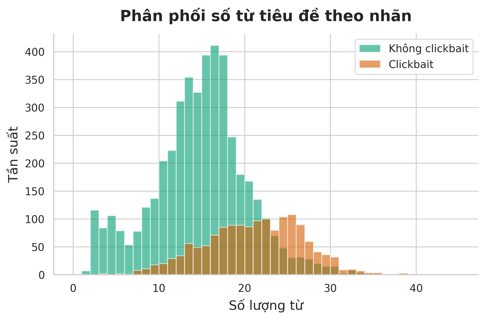
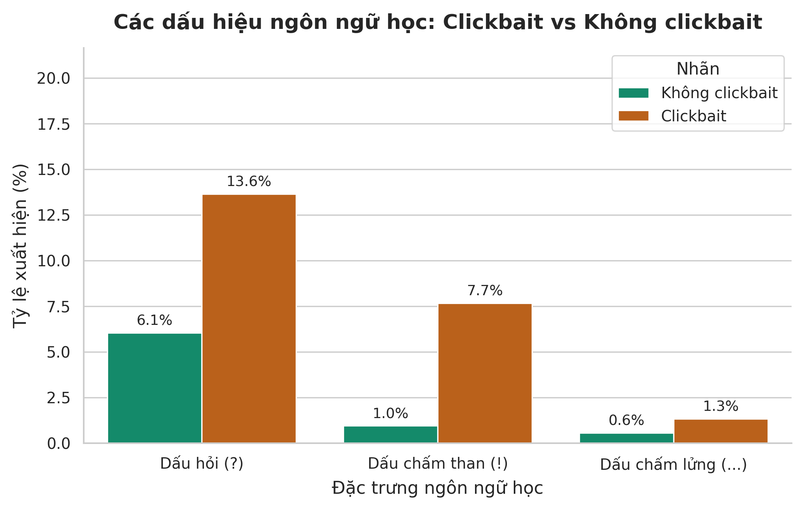
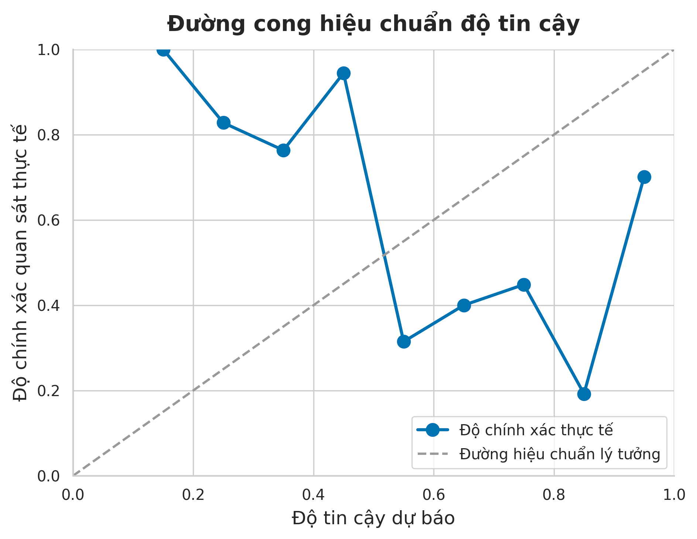
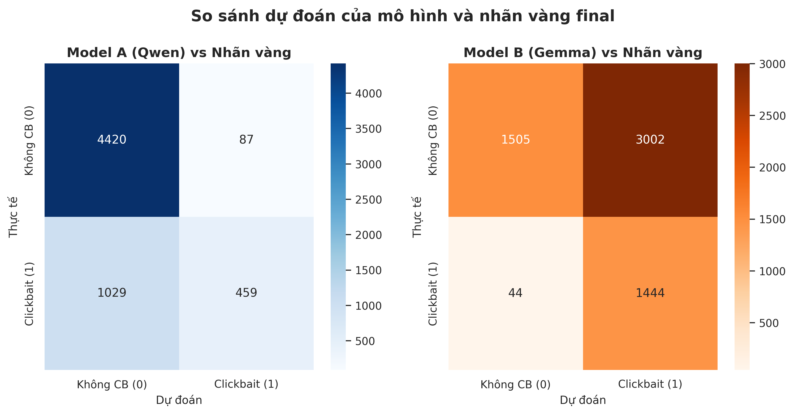

[TWO-COLUMN]

# Tiền xử lý và xây dựng bộ dữ liệu phục vụ bài toán phát hiện tiêu đề báo điện tử clickbait tiếng Việt

**Trần Ngọc Gia Huy**  
*Đại học Công nghệ Thông tin, ĐHQG-HCM*  
*Mã số sinh viên: [MSSV]*  
*Email: [Email]*  

---

### TÓM TẮT
Phát hiện tiêu đề báo điện tử giật gân (clickbait) là một tác vụ quan trọng nhằm bảo vệ người đọc trước các nội dung rác và duy trì tính toàn vẹn của không gian thông tin số. Tuy nhiên, các nghiên cứu phát hiện clickbait tiếng Việt hiện nay đang đối mặt với sự thiếu hụt nghiêm trọng các bộ dữ liệu chuẩn hóa có quy mô lớn, hướng dẫn gán nhãn chi tiết và cơ chế kiểm soát chất lượng nghiêm ngặt. Nghiên cứu này trình bày quy trình tiền xử lý và xây dựng bộ dữ liệu phát hiện clickbait tiếng Việt gồm 6.000 mẫu tiêu đề bài viết từ 6 tòa soạn báo điện tử phổ biến tại Việt Nam (afamily, kenh14, nhandan, soha, thanhnien, tuoitre) được thu thập vào tháng 6 năm 2026. Chúng tôi đề xuất một kiến trúc gán nhãn lai kết hợp giữa hai mô hình ngôn ngữ lớn (LLM) cục bộ (Qwen 2.5 3B Instruct và Gemma 2 2B Instruct) chấm điểm độc lập theo rubric 4 tiêu chí và hệ thống kiểm duyệt thủ công (Human-in-the-loop) để giải quyết triệt để các trường hợp bất đồng thuận nhãn và biên. Nhằm bảo đảm chất lượng nghiêm ngặt của nhãn vàng, hệ thống được cấu hình ưu tiên độ an toàn cao khiến con người phải can thiệp kiểm duyệt thủ công 66,13% tổng thể dữ liệu, song quy trình này vẫn giúp tối ưu hóa và tiết kiệm 33,87% chi phí nhân lực so với gán nhãn thủ công toàn bộ. Kết quả đo lường độ đồng thuận liên người đánh giá (Inter-Annotator Agreement) cho thấy sự trôi lệch ngưỡng gán nhãn nghiêm trọng giữa hai LLM với hệ số Cohen's Kappa chỉ đạt 0,0598 và Fleiss' Kappa đạt -0,2689, qua đó khẳng định tầm quan trọng cốt lõi của bước kiểm duyệt thủ công. Bộ dữ liệu cuối cùng có tỷ lệ clickbait tự nhiên là 24,80% (1.488 mẫu), được chia tập huấn luyện/kiểm định/kiểm thử theo phương pháp phân tầng (Stratified Split) nhằm triệt tiêu hiện tượng trôi lệch nhãn (drift) lên tới 14,88% của phương pháp chia theo thời gian (Temporal Split). Thực nghiệm trên các mô hình baseline học máy truyền thống và trích xuất đặc trưng PhoBERT đạt kết quả F1-macro cao nhất là 0,7784 với mô hình PhoBERT + Logistic Regression, xác nhận độ khó cao của bài toán và tính ứng dụng thực tiễn của bộ dữ liệu được đề xuất.

**Từ khóa:** Clickbait tiếng Việt, Tiền xử lý dữ liệu, Song hành LLM, Kiểm duyệt thủ công, Trôi lệch dữ liệu, PhoBERT.

---

## 1. GIỚI THIỆU

Sự bùng nổ của mạng xã hội và báo điện tử tại Việt Nam trong những năm gần đây đã biến không gian số thành kênh tiếp cận thông tin chủ đạo của người dân. Tuy nhiên, sự cạnh tranh khốc liệt về lưu lượng truy cập (traffic) và mô hình doanh thu dựa trên số lượt nhấp chuột (ad-driven business model) đã dẫn đến sự lan tràn của các tiêu đề báo chí giật gân, hay còn gọi là clickbait [1]. Tiêu đề clickbait thường áp dụng các thủ pháp ngôn từ tinh vi như cố tình ẩn giấu thông tin cốt lõi, phóng đại cảm xúc, định khung cú pháp hối thúc hoặc đưa ra thông tin bất tương đồng so với nội dung thực tế của bài viết [2]. Hệ quả là, clickbait gây lãng phí thời gian của độc giả, làm suy giảm nghiêm trọng uy tín của các cơ quan truyền thông báo chí chân chính, đồng thời tạo ra một môi trường thông tin nhiễu loạn và thiếu lành mạnh. Do đó, việc nghiên cứu các giải pháp kỹ thuật nhằm phát hiện và ngăn chặn tiêu đề clickbait tự động là một nhu cầu vô cùng cấp thiết trong lĩnh vực xử lý ngôn ngữ tự nhiên (NLP) và an toàn thông tin tại Việt Nam.

Mặc dù bài toán phát hiện clickbait đã được nghiên cứu rộng rãi trên thế giới, đặc biệt là đối với tiếng Anh với các nghiên cứu tiên phong của Potthast và các cộng sự [1], Chakraborty và các cộng sự [2], các nghiên cứu tương tự đối với tiếng Việt vẫn còn đang ở giai đoạn sơ khởi và đối mặt với nhiều rào cản kỹ thuật. Đầu tiên, tiếng Việt có đặc trưng ngữ pháp và ngữ nghĩa phong phú, với các cấu trúc ẩn dụ và hư từ đặc thù thường được sử dụng để giật tít, đòi hỏi các mô hình phải có khả năng hiểu sâu văn cảnh ngôn ngữ học nước nhà. Thứ hai, các bộ dữ liệu clickbait tiếng Việt hiện tại có quy mô rất hạn chế; ví dụ, bộ dữ liệu ViClickbait-2025 [18] chỉ bao gồm 3.414 tiêu đề và được gán nhãn hoàn toàn thủ công, điều này gây khó khăn lớn cho việc huấn luyện các mô hình học sâu hiện đại vốn đòi hỏi lượng dữ liệu giám sát lớn. Thứ ba, việc gán nhãn thủ công quy mô lớn gặp thách thức về mặt chi phí và tính nhất quán, trong khi chưa có nghiên cứu nào tại Việt Nam thử nghiệm các kỹ thuật gán nhãn tự động hóa có kiểm soát sử dụng mô hình ngôn ngữ lớn (LLM) để tối ưu hóa chi phí như xu hướng thế giới [7], [8].

Để giải quyết các hạn chế trên, nghiên cứu này xây dựng và công bố một bộ dữ liệu phát hiện clickbait tiếng Việt quy mô 6.000 mẫu đạt chuẩn nghiên cứu khoa học. Nghiên cứu đóng góp các điểm chính sau đây:

1. **Quy trình tiền xử lý và làm sạch dữ liệu nghiêm ngặt hai lớp:** Thiết kế và thực nghiệm thành công hệ thống loại bỏ trùng lặp tuyệt đối kết hợp loại bỏ trùng lặp ngữ nghĩa (sử dụng mô hình embedding đa ngôn ngữ paraphrase-multilingual-MiniLM-L12-v2 kết hợp độ đo Cosine Similarity), đảm bảo loại bỏ triệt để các tin tức trùng lặp hoặc sao chép lẫn nhau giữa các nguồn tin điện tử, ngăn ngừa tối đa hiện tượng rò rỉ dữ liệu (data leakage) trong các tác vụ học máy.
2. **Kiến trúc gán nhãn lai Dual-LLM kết hợp Human-in-the-loop:** Đề xuất và vận hành hệ thống gán nhãn song hành sử dụng hai mô hình ngôn ngữ lớn cục bộ (Qwen 2.5 3B Instruct và Gemma 2 2B Instruct) chạy trên hạ tầng phần cứng cá nhân giới hạn. Hệ thống áp dụng rubric chấm điểm chi tiết 4 khía cạnh ngôn ngữ học (BARS), tự động phát hiện các trường hợp bất đồng thuận nhãn hoặc điểm số biên để định tuyến (routing) sang cho kiểm duyệt viên con người đánh giá lại, bảo đảm nhãn chất lượng vàng (gold standard) đồng thời tiết kiệm 33,87% chi phí nhân lực gán nhãn thủ công thông qua việc tự động hóa các nhãn đồng thuận tuyệt đối.
3. **Đánh giá toàn diện độ đồng thuận liên người đánh giá (IAA):** Đo lường chi tiết sự bất đồng thuận và thiên lệch hệ thống giữa hai LLM thông qua các hệ số Cohen's Kappa, Fleiss' Kappa, Gwet's AC1 và Krippendorff's Alpha, từ đó chỉ ra hiện tượng "nghịch lý Kappa" do sự lệch ngưỡng gán nhãn cực đoan của các mô hình ngôn ngữ nhỏ.
4. **Phân tích trôi lệch phân phối nhãn và giải pháp Stratified Split:** Chứng minh thực nghiệm rằng phương pháp phân chia dữ liệu theo thời gian (Temporal Split) truyền thống gây ra hiện tượng trôi lệch dữ liệu (data drift) nghiêm trọng lên tới 14,88% đối với bài toán clickbait, đồng thời đề xuất giải pháp chia tập phân tầng (Stratified Split) tối ưu hơn để bảo toàn tính nhất quán của tập huấn luyện và tập kiểm thử.
5. **Thiết lập hệ thống mô hình baseline chuẩn hóa:** Huấn luyện và đánh giá hiệu năng các mô hình baseline học máy truyền thống (TF-IDF kết hợp Logistic Regression, SVM) và các mô hình biểu diễn ngữ nghĩa hiện đại (PhoBERT Feature Extraction) trên bộ dữ liệu mới, thiết lập thang đo benchmark chuẩn cho các nghiên cứu tiếp theo.

Phần còn lại của bài báo được cấu trúc như sau: Phần 2 tổng hợp các nghiên cứu liên quan. Phần 3 định nghĩa bài toán và xây dựng ontology gán nhãn. Phần 4 chi tiết hóa quy trình thu thập và tiền xử lý dữ liệu thô. Phần 5 mô tả hệ thống gán nhãn tự động và đánh giá độ thỏa thuận IAA. Phần 6 tiến hành phân tích khám phá dữ liệu (EDA). Phần 7 trình bày chiến lược chia tập và định dạng dữ liệu cuối cùng. Phần 8 công bố kết quả thực nghiệm mô hình baseline. Phần 9 thảo luận về các đóng góp và giới hạn của nghiên cứu, và Phần 10 kết luận bài báo.

---

## 2. CÔNG TRÌNH LIÊN QUAN

### 2.1 Phát hiện Clickbait tiếng Anh
Nghiên cứu phát hiện clickbait ban đầu tập trung chủ yếu vào việc trích xuất các đặc trưng ngôn ngữ học thủ công trên dữ liệu tiếng Anh. Potthast và các cộng sự [1] là những người đầu tiên chuẩn hóa tác vụ này bằng cách xây dựng một bộ dữ liệu clickbait trên Twitter thông qua nền tảng đám đông (crowdsourcing) và phát triển các mô hình phân loại sử dụng các đặc trưng như độ dài từ, tần suất tính từ giật gân, và cấu trúc cú pháp câu hỏi. Chakraborty và các cộng sự [2] mở rộng nghiên cứu bằng hệ thống "Stop Clickbait", tích hợp thêm các đặc trưng ngữ nghĩa và cú pháp câu phức tạp hơn để đạt hiệu năng phân loại vượt trội. Đến năm 2018, Potthast và các cộng sự [3] đã xuất bản một tập dữ liệu clickbait quy mô lớn hơn với hơn 38.000 bài viết trên Twitter, thiết lập một tiêu chuẩn mới cho việc đánh giá các mô hình deep learning. Tuy nhiên, các kỹ thuật trích xuất đặc trưng ngôn ngữ này không thể áp dụng trực tiếp sang tiếng Việt do sự khác biệt cơ bản về loại hình ngôn ngữ (tiếng Anh là ngôn ngữ biến hình, trong khi tiếng Việt là ngôn ngữ đơn lập, không biến hình từ và ranh giới từ không được phân tách bằng khoảng trắng).

### 2.2 Xử lý ngôn ngữ tự nhiên tiếng Việt
Sự phát triển của NLP tiếng Việt ghi nhận những bước nhảy vọt nhờ sự ra đời của các mô hình ngôn ngữ tiền huấn luyện chuyên biệt. PhoBERT [4], một kiến trúc RoBERTa được huấn luyện trên kho ngữ liệu tiếng Việt quy mô 20GB, đã thiết lập các đỉnh hiệu năng mới (state-of-the-art) trên hầu hết các tác vụ NLP tiếng Việt như phân tích cú pháp, gán nhãn thực thể và phân loại văn bản. Kế tiếp, PhoNLP [5] tích hợp đa tác vụ đồng thời giúp tối ưu hóa việc trích xuất thông tin ngữ pháp. Trong mảng xây dựng dữ liệu phân loại tin tức và cảm xúc tiếng Việt, UIT-VSFC [6] là bộ dữ liệu chuẩn mực phục vụ phân tích cảm xúc sinh viên, trong khi ReINTEL [16] mở ra hướng nghiên cứu phát hiện tin giả (fake news) trên mạng xã hội Việt Nam. Gần đây nhất, ViFactCheck [17] đã xây dựng hệ thống kiểm chứng thông tin tiếng Việt. Mặc dù vậy, mảng đề tài clickbait chỉ thực sự được chú ý với công trình ViClickbait-2025 [18]. Tuy nhiên, ViClickbait-2025 có giới hạn lớn về mặt quy mô (3.414 mẫu) và quy trình gán nhãn thủ công tốn kém, chưa khai thác khả năng của LLM và chưa đánh giá độ thỏa thuận liên người đánh giá một cách toàn diện.

### 2.3 Gán nhãn dữ liệu bằng LLM và độ thỏa thuận liên người đánh giá
Trong những năm gần đây, việc sử dụng các mô hình ngôn ngữ lớn như GPT-3 và GPT-4 làm công cụ gán nhãn dữ liệu tự động thay thế con người đã trở thành một xu hướng nghiên cứu nổi bật nhằm cắt giảm chi phí sản xuất dữ liệu. Wang và các cộng sự [7] đã chứng minh thực nghiệm rằng GPT-3 có khả năng tạo ra các nhãn dữ liệu chất lượng cao tương đương với các dịch vụ đám đông nhưng với chi phí chỉ bằng một phần nhỏ. Gilardi và các cộng sự [8] khẳng định ChatGPT thậm chí vượt trội hơn con người ở một số tác vụ phân loại văn bản về tính nhất quán và khả năng tuân thủ hướng dẫn gán nhãn. He và các cộng sự [9] đề xuất khung làm việc AnnoLLM nhằm tối ưu hóa prompt thông qua lập luận Chain-of-Thought (CoT) để sinh nhãn chuẩn xác. Tuy nhiên, các nghiên cứu này hầu hết áp dụng trên các mô hình nguồn đóng đắt đỏ (OpenAI API), và chưa có nghiên cứu nào đánh giá sâu sắc độ thỏa thuận liên người đánh giá (Inter-Annotator Agreement - IAA) giữa các LLM cục bộ (local LLM) quy mô nhỏ và con người trên ngôn ngữ đặc thù như tiếng Việt. Trong khoa học xây dựng dữ liệu học máy, việc đo lường độ đồng thuận thông qua hệ số Cohen's Kappa [10] (cho 2 người đánh giá), Fleiss' Kappa [11] (cho nhiều người đánh giá) và bảng diễn giải của Landis & Koch [12] là tiêu chuẩn bắt buộc để chứng minh tính tin cậy khoa học của nhãn, điều mà các nghiên cứu clickbait tiếng Việt trước đây đã bỏ qua. Đồng thời, việc tuân thủ các đặc tả đạo đức dữ liệu như Datasheets for Datasets [13] và Data Statements [14] ngày càng trở thành yêu cầu sống còn để ngăn ngừa thiên kiến hệ thống [15].

---

## 3. ĐỊNH NGHĨA BÀI TOÁN VÀ ONTOLOGY GÁN NHÃN

### 3.1 Định nghĩa bài toán
Cho một tiêu đề bài báo điện tử tiếng Việt $T$ và đoạn mở đầu (sapo) hoặc nội dung tóm tắt tương ứng $S$. Bài toán phát hiện clickbait được định nghĩa là một tác vụ phân loại nhị phân nhằm tìm ra ánh xạ $f: (T, S) \rightarrow Y$, trong đó $Y \in \{0, 1\}$. 
*   Nhãn $Y = 1$ (Clickbait): Tiêu đề cố tình áp dụng các thủ pháp tu từ hoặc cấu trúc thông tin lệch chuẩn nhằm tạo khoảng trống tri thức hoặc kích động cảm xúc của độc giả một cách giả tạo, ép buộc họ phải thực hiện hành vi nhấp chuột để tìm hiểu thông tin vốn lẽ ra phải được phản ánh khách quan trên tiêu đề.
*   Nhãn $Y = 0$ (Non-clickbait): Tiêu đề cung cấp thông tin trung thực, rõ ràng, phản ánh đầy đủ và khách quan nội dung cốt lõi của sự kiện được mô tả trong phần sapo và thân bài.

### 3.2 Hệ thống phân loại nhãn và Rubric BARS
Để đảm bảo tính nhất quán và loại bỏ sự chủ quan trong quá trình gán nhãn của cả mô hình và con người, chúng tôi thiết kế bộ tiêu chí gán nhãn BARS gồm 4 khía cạnh ngôn ngữ học đặc trưng của clickbait báo chí Việt Nam, được kế thừa và tùy biến từ các nghiên cứu clickbait kinh điển [1], [2] và hướng dẫn gán nhãn thực tế của dự án [docs/annotation_guideline.md](file:///d:/UIT/DS108/projectfn/docs/annotation_guideline.md). Mỗi tiêu chí được đánh giá trên thang điểm từ 0 đến 2 điểm:

1.  **C1: Phóng đại cảm xúc (Sensationalism):** Đánh giá mức độ sử dụng các tính từ mạnh, động từ kích động hoặc dấu câu cực đoan nhằm giật gân hóa sự việc.
    *   *0 điểm (Không):* Tiêu đề sử dụng từ vựng trung lập, khách quan.
    *   *1 điểm (Nhẹ):* Sử dụng từ nhấn mạnh cảm xúc phổ biến (ví dụ: "ngỡ ngàng", "nóng", "xôn xao") nhưng không bóp méo bản chất sự việc.
    *   *2 điểm (Nặng):* Lạm dụng các từ ngữ kích động mạnh, giật gân thái quá hoặc từ lóng mạng (ví dụ: "sốc tận óc", "ngã ngửa", "rùng mình", "không thể tin nổi").
2.  **C2: Khoảng trống thông tin (Information Gap):** Đánh giá việc tiêu đề cố tình che giấu các thành phần chủ chốt của sự kiện (chủ thể, hành động hoặc kết quả) để tạo sự tò mò.
    *   *0 điểm (Không):* Tiêu đề có cấu trúc cú pháp hoàn chỉnh, nêu rõ ai đã làm gì và kết quả ra sao.
    *   *1 điểm (Nhẹ):* Ẩn đi một vài chi tiết bối cảnh phụ (thời gian, địa điểm cụ thể) nhưng vẫn giữ được bộ khung sự kiện cốt lõi.
    *   *2 điểm (Nặng):* Cố tình cắt đứt thông tin quan trọng nhất bằng câu lửng lơ hoặc đại từ vô định (ví dụ: "tiết lộ lý do...", "bí mật đằng sau điều này...", "...và cái kết").
3.  **C3: Định khung cú pháp (Syntactic Framing):** Đánh giá việc sử dụng các cấu trúc câu đặc biệt để hối thúc hoặc áp đặt hành vi của người đọc.
    *   *0 điểm (Không):* Sử dụng câu khẳng định trung thực hoặc câu hỏi truy vấn thông tin chuẩn mực báo chí.
    *   *1 điểm (Nhẹ):* Sử dụng câu hỏi gợi mở hoặc câu cảm thán ngắn để tăng tính tương tác tự nhiên.
    *   *2 điểm (Nặng):* Áp dụng câu mệnh lệnh trực tiếp, hối thúc hành vi hoặc câu hỏi tu từ mang tính khiêu khích (ví dụ: "đọc ngay kẻo lỡ!", "chớ dại làm điều này").
4.  **C4: Tính bất tương đồng (Incongruence):** Đánh giá sự mâu thuẫn hoặc sai lệch thông tin giữa tiêu đề và phần sapo/thân bài.
    *   *0 điểm (Không):* Nội dung tiêu đề hoàn toàn trùng khớp và phản ánh trung thực phần sapo.
    *   *1 điểm (Nhẹ):* Tiêu đề nhấn mạnh hơi quá đà vào một chi tiết phụ hoặc một trích dẫn gián tiếp trong bài để thu hút sự chú ý.
    *   *2 điểm (Nặng):* Tiêu đề đưa ra thông tin mâu thuẫn trực tiếp, thổi phồng phi thực tế hoặc hoàn toàn không tìm thấy liên hệ nào trong phần nội dung bài viết.

Quy tắc nhãn cuối cùng dựa trên tổng điểm rubric:
$$\text{rubric\_total} = C_1 + C_2 + C_3 + C_4$$
Nếu $\text{rubric\_total} \ge 4$, mẫu được phân loại tạm thời là Clickbait (1). Nếu $\text{rubric\_total} \le 3$, mẫu được phân loại là Non-clickbait (0).

### 3.3 Biện luận thiết kế: Phân loại đa nhãn rubric so với nhị phân trực tiếp
Chúng tôi quyết định chấm điểm theo hệ thống rubric đa nhãn (0–2 điểm cho mỗi tiêu chí trong số 4 tiêu chí) thay vì yêu cầu mô hình gán nhãn nhị phân (0 hoặc 1) trực tiếp ngay từ đầu. Chúng tôi chọn phương pháp này vì clickbait là một khái niệm mang tính chất ranh giới và có biên độ xê dịch lớn về mặt ngôn từ. Việc gán nhãn nhị phân trực tiếp buộc mô hình phải đưa ra quyết định "có hoặc không" một cách chủ quan mà không cần phân tích các khía cạnh cấu thành, dẫn đến hiện tượng "gán nhãn lười biếng" (lazy labeling) và làm giảm tính nhất quán giữa các lần chạy. Trái lại, thiết kế rubric buộc mô hình phải phân rã tiêu đề thành 4 chiều đặc trưng ngôn ngữ học độc lập, từ đó cải thiện tính giải thích được (explainability) của nhãn và giúp con người dễ dàng truy vết lý do mô hình phân loại. Nếu áp dụng gán nhãn nhị phân trực tiếp, chúng tôi sẽ mất đi các dữ liệu chi tiết về mức độ nghiêm trọng (severity) của clickbait, đồng thời không thể thiết lập cơ chế định tuyến tự động cho các mẫu có điểm số biên (bằng đúng 4) - nơi có nguy cơ sai số cao nhất.

### 3.4 Các trường hợp biên (edge cases) và hướng xử lý
Trong quá trình xây dựng dữ liệu, nhóm nghiên cứu ghi nhận hai nhóm trường hợp biên phổ biến:
*   *Tiêu đề hấp dẫn nhưng không clickbait (Attractive vs. Clickbait):* Nhiều tiêu đề được viết rất hay, giàu chất văn học hoặc sử dụng phép chơi chữ nghệ thuật nhưng vẫn cung cấp đầy đủ thông tin sự kiện cốt lõi. Trong trường hợp này, các mô hình ngôn ngữ lớn thường bị nhầm lẫn và đánh giá là clickbait do sự xuất hiện của các từ vựng phi truyền thống. Quy định xử lý đối với trường hợp này là nếu tiêu đề cung cấp đủ chủ thể và hành động chính, bắt buộc phải gán nhãn 0 bất kể tiêu đề có tính hấp dẫn cao.
*   *Tiêu đề chứa từ cảm thán tự nhiên:* Một số tin tức thể thao hoặc giải trí có chứa các từ như "vỡ òa", "tiếc nuối" phản ánh đúng không khí thực tế của sự kiện. Chúng tôi quy định nếu các từ ngữ này phản ánh chính xác trạng thái thực tế được mô tả trong sapo (ví dụ: đội tuyển quốc gia thắng trận phút cuối), tiêu chí C1 chỉ được chấm tối đa 1 điểm và nhãn cuối cùng thường là 0.

---

## 4. THU THẬP VÀ LÀM SẠCH DỮ LIỆU

### 4.1 Chiến lược thu thập dữ liệu
Để đảm bảo bộ dữ liệu phản ánh toàn diện bức tranh báo chí điện tử Việt Nam, chúng tôi đã tiến hành thu thập dữ liệu từ 6 nguồn báo điện tử lớn có chính sách tòa soạn (editorial policy) và đối tượng độc giả (demographics) vô cùng đa dạng:
*   **Báo Nhân Dân:** Cơ quan ngôn luận của Đảng Cộng sản Việt Nam, đại diện cho dòng báo chí chính luận chính thống, nghiêm túc, có quy chuẩn biên tập cực kỳ khắt khe.
*   **Báo Tuổi Trẻ & Báo Thanh Niên:** Hai tờ báo chính thống lớn hàng đầu cả nước, hướng đến độc giả đại chúng với thông tin thời sự, xã hội nhanh nhạy nhưng vẫn bảo đảm tính chuẩn mực.
*   **Soha News:** Trang thông tin điện tử tổng hợp, có xu hướng giật tít nhanh để thu hút tương tác ở mảng tin tức xã hội và quốc tế.
*   **Kênh14 & Afamily:** Hai trang thông tin giải trí, đời sống xã hội chủ yếu hướng đến giới trẻ và phụ nữ. Các trang này áp dụng mô hình doanh thu phụ thuộc nặng nề vào lượt xem hiển thị (pageviews), do đó tần suất xuất hiện tiêu đề giật gân, câu khách là rất cao.

Chúng tôi kết hợp hai phương thức crawling: **RSS crawler** và **Sitemap crawler**:
*   *Sitemap crawler* được ưu tiên áp dụng cho các nguồn tin có cấu trúc lưu trữ lịch sử tốt như Nhân Dân, Tuổi Trẻ, Thanh Niên để thu thập dữ liệu phân bố đều theo các chuyên mục chính luận.
*   *RSS crawler* được ưu tiên cho Kênh14, Afamily và Soha nhằm bắt kịp các bài viết mới xuất bản liên tục theo thời gian thực — thời điểm các tiêu đề clickbait thường có xu hướng thay đổi hoặc giật gân nhất trước khi được biên tập viên điều chỉnh lại nếu gặp phản ứng từ độc giả.

Nhóm nghiên cứu đã phát triển cơ chế loại trùng lặp dựa trên Manifest (Manifest-based deduplication) ngay trong tiến trình crawl để ngăn chặn việc ghi đè hoặc tải lại các URL cũ đã tồn tại trong các tệp lưu trữ tạm thời.

### 4.2 Tiền xử lý và làm sạch dữ liệu
Quy trình tiền xử lý được thiết kế theo dạng đường ống (pipeline) tuần tự gồm 4 giai đoạn chính nhằm đảm bảo độ sạch tối đa của dữ liệu trước khi đưa vào gán nhãn:

```text
[Dữ liệu thô: 15.000 mẫu]
       │
       ▼ (Giai đoạn 1: Lọc URL hợp lệ)
[Dữ liệu sau lọc URL: 14.248 mẫu]
       │
       ▼ (Giai đoạn 2: Bộ lọc Quality Scorer >= 4)
[Dữ liệu hợp lệ: 14.149 mẫu]
       │
       ▼ (Giai đoạn 3 & 4: Lọc trùng lặp tuyệt đối & ngữ nghĩa)
[Dữ liệu sạch hoàn toàn: 13.760 mẫu]
       │
       ▼ (Lấy mẫu ngẫu nhiên phân tầng theo nguồn báo)
[Tập dữ liệu gán nhãn: 6.000 mẫu]
```

1.  **Quality Scoring Pipeline (Đánh giá chất lượng trích xuất):** Văn bản thô sau khi parse HTML bằng thư viện `trafilatura` và `BeautifulSoup4` được đưa qua bộ lọc chất lượng gồm 6 tiêu chí nhị phân: (i) tiêu đề hợp lệ, (ii) sapo hợp lệ, (iii) có xem trước thân bài, (iv) thân bài đạt độ dài tối thiểu 150 từ, (v) không phải trang tổng hợp link, (vi) mức độ lặp từ thấp. Mỗi tiêu chí đạt được tính 1 điểm. Chúng tôi chọn ngưỡng điểm chất lượng **quality_score >= 4** làm điều kiện giữ lại bài viết. Biện luận thiết kế: Chúng tôi chọn ngưỡng này vì nếu đặt ngưỡng quá cao (ví dụ: 6/6), hệ thống sẽ vô tình loại bỏ các tiêu đề clickbait vốn thường đi kèm với phần sapo cực kỳ ngắn hoặc thân bài viết sơ sài (thin content). Nếu đặt ngưỡng quá thấp (< 4), dữ liệu đầu vào sẽ chứa các trang HTML lỗi parser, mất chữ hoặc chứa toàn quảng cáo rác, làm nhiễu nghiêm trọng tín hiệu ngữ nghĩa của văn bản.
2.  **Exact Deduplication (Loại bỏ trùng lặp tuyệt đối):** Thực hiện loại bỏ các bài viết trùng lặp hoàn toàn dựa trên so khớp chuỗi URL gốc và mã băm MD5 của tiêu đề văn bản. Bước này giúp loại bỏ nhanh các bài viết bị crawl trùng do trùng lặp nguồn RSS.
3.  **Semantic Deduplication (Loại bỏ trùng lặp ngữ nghĩa):** Các bài viết đi qua lớp lọc tuyệt đối vẫn có thể bị trùng lặp nội dung do hiện tượng sao chép bài viết (syndication) giữa các trang báo con trong cùng một tổng công ty truyền thông hoặc các bài viết tổng hợp lại từ một nguồn tin gốc. Chúng tôi sử dụng mô hình embedding đa ngôn ngữ `paraphrase-multilingual-MiniLM-L12-v2` để chuyển đổi tiêu đề và sapo thành vector biểu diễn, sau đó tính toán độ tương đồng Cosine (Cosine Similarity) giữa tất cả các cặp bài viết. Hệ thống lọc trùng lặp ngữ nghĩa sử dụng 3 ngưỡng phân tầng: tự động loại bỏ khi similarity >= 0,97; đánh dấu probable duplicate khi 0,92–0,97; đưa vào review queue khi 0,85–0,92. Ngưỡng giữ lại là < 0,85. Điều kiện bổ sung: cả title và sapo đều phải vượt ngưỡng pre-filter mới bị xét là duplicate. Biện luận thiết kế: Thiết kế phân tầng này giúp tối ưu hóa sự cân bằng giữa việc loại bỏ trùng lặp và giữ lại các bài viết đưa tin về cùng một sự kiện thời sự nóng dưới góc nhìn khác nhau, đồng thời ngăn chặn hiện tượng rò rỉ dữ liệu (data leakage) giữa các tập chia.
4.  **Text Normalization (Chuẩn hóa văn bản):** Áp dụng chuẩn hóa Unicode dựng sẵn (NFC), loại bỏ các ký tự điều khiển lỗi thời, chuẩn hóa khoảng trắng và làm sạch các thẻ HTML còn sót lại.

### 4.3 Thống kê dữ liệu thô và tỷ lệ lọc bỏ
Bảng 1 thể hiện chi tiết biến động số lượng bản ghi của 6 nguồn báo qua các giai đoạn trong đường ống tiền xử lý dữ liệu.

**Bảng 1: Thống kê số lượng bài viết qua các giai đoạn tiền xử lý**
| Nguồn báo | Thu thập thô | Sau lọc URL | Sau đánh giá chất lượng | Sau loại trùng lặp | Chọn mẫu gán nhãn |
| :--- | :---: | :---: | :---: | :---: | :---: |
| afamily | 2.500 | 2.500 | 2.486 | 2.482 | 1.000 |
| kenh14 | 2.500 | 2.500 | 2.481 | 2.295 | 1.000 |
| nhandan | 2.500 | 1.763 | 1.738 | 1.738 | 1.000 |
| soha | 2.500 | 2.500 | 2.482 | 2.283 | 1.000 |
| thanhnien | 2.500 | 2.485 | 2.480 | 2.480 | 1.000 |
| tuoitre | 2.500 | 2.500 | 2.482 | 2.482 | 1.000 |
| **Tổng cộng** | **15.000** | **14.248** | **14.149** | **13.760** | **6.000** |

Phân tích số liệu cho thấy, giai đoạn loại bỏ trùng lặp ngữ nghĩa và tuyệt đối là bước lọc có tỷ lệ loại bỏ tương đối nhỏ (giảm từ 14.149 mẫu xuống còn 13.760 mẫu, tương đương tỷ lệ loại bỏ 2,75%). Điều này phản ánh thực trạng phân phối tin tức tại Việt Nam, nơi các trang tin điện tử giải trí như Kênh14, Afamily và Soha thường xuyên chia sẻ hoặc đăng lại bài viết của nhau, dẫn đến mật độ trùng lặp thông tin rất cao. Báo Nhân Dân có số lượng bài viết bị loại lớn nhất ở bước lọc URL (giảm từ 2.500 xuống 1.763) do nhiều URL không hợp lệ hoặc lỗi định dạng HTML đặc thù ở trang chuyên mục của họ. Sự phân bổ này được minh họa trực quan trong Hình 1.



Từ tập dữ liệu sạch 13.760 mẫu, chúng tôi tiến hành chọn mẫu ngẫu nhiên phân tầng (Stratified Random Sampling) lấy đúng 1.000 mẫu cho mỗi nguồn tin, tạo ra tập dữ liệu 6.000 mẫu chuẩn bị cho quy trình gán nhãn.

---

## 5. HỆ THỐNG GÁN NHÃN TỰ ĐỘNG VÀ KIỂM SOÁT CHẤT LƯỢNG

### 5.1 Kiến trúc Dual-LLM Annotation
Để gán nhãn cho 6.000 tiêu đề tin tức, chúng tôi đề xuất kiến trúc gán nhãn song hành Dual-LLM hoạt động trên môi trường cục bộ thông qua nền tảng Ollama. Kiến trúc sử dụng hai mô hình ngôn ngữ nhỏ khác nhau về mặt kiến trúc và dữ liệu tiền huấn luyện:
1.  **Model A:** Qwen 2.5 3B Instruct (`qwen2.5:3b-instruct-q4_K_M`)
2.  **Model B:** Gemma 2 2B Instruct (`gemma2:2b-instruct-q4_K_M`)

Chúng tôi quyết định sử dụng **hai mô hình ngôn ngữ lớn cục bộ song hành** thay vì chỉ sử dụng một mô hình duy nhất hoặc sử dụng các API thương mại đám mây vì những lý do chiến lược sau:
*   *Tăng độ phủ quan điểm (Perspective Diversity):* Qwen và Gemma được phát triển bởi hai tập đoàn công nghệ khác nhau (Alibaba và Google), huấn luyện trên hai kho ngữ liệu tiếng Anh-Trung và tiếng Anh toàn cầu hoàn toàn khác biệt. Điều này dẫn đến sự khác nhau trong cách hai mô hình nhìn nhận cấu trúc tu từ tiếng Việt. Việc chạy song hành cho phép hệ thống tận dụng sự bù trừ sai số lẫn nhau, tăng cường khả năng phát hiện các sắc thái clickbait đa dạng.
*   *Phát hiện các mẫu bất đồng thuận:* Sự không thống nhất về điểm số giữa hai mô hình chính là tín hiệu chỉ thị rõ ràng nhất cho thấy mẫu tiêu đề đó nằm ở khu vực ranh giới nhạy cảm (borderline cases), giúp tự động chuyển hướng các mẫu khó này đến cho con người đánh giá, thay vì chấp nhận mù quáng một nhãn lỗi từ một mô hình đơn lẻ.
*   *Lợi ích của Local LLM so với API thương mại:* Sử dụng Ollama chạy local giúp bảo mật tuyệt đối dữ liệu thu thập, tránh rủi ro thay đổi hành vi mô hình do nhà cung cấp cập nhật API (reproducibility crisis), đồng thời triệt tiêu hoàn toàn chi phí tài chính. Hệ thống được cấu hình chạy tuần tự (chỉ tải một model vào VRAM tại một thời điểm) để vận hành ổn định trên card đồ họa phổ thông RTX 3050 Ti 4GB mà không gây tràn bộ nhớ.

Chúng tôi thiết kế **Persona-differentiated prompting** (Prompt khác biệt hóa vai trò) cho từng mô hình nhằm kích hoạt các thiên hướng đánh giá khác nhau. Qwen 2.5 3B được định hình là một "Chuyên gia Ngôn ngữ học khắt khe", tập trung sâu vào phân tích cấu trúc cú pháp ẩn giấu thông tin (C2) và định khung hành vi (C3). Gemma 2 2B được giao vai trò là một "Biên tập viên Báo chí nhạy bén", nhạy cảm với các yếu tố giật gân, phóng đại cảm xúc (C1) và tính bất tương đồng nội dung (C4). Điều này giúp tối đa hóa khả năng phát hiện lỗi biên của cả hai mô hình.

### 5.2 Cơ chế bỏ phiếu (Voting) và định tuyến (Routing) sang kiểm duyệt viên con người
Hệ thống kiểm soát chất lượng nhãn được vận hành theo sơ đồ thuật toán định tuyến tự động như sau:
*   **Bước 1:** Model A và Model B thực hiện chấm điểm độc lập dựa trên Rubric BARS cho tiêu đề $T$ và sapo $S$. Trả về điểm số chi tiết $[C_1, C_2, C_3, C_4]$ và nhãn dự đoán $Y_{model} \in \{0, 1\}$.
*   **Bước 2:** Tính toán tổng điểm trung bình rubric của hai mô hình:
    $$\text{rubric\_avg} = \frac{\text{rubric\_total}_A + \text{rubric\_total}_B}{2}$$
*   **Bước 3 (Định tuyến tự động):**
    *   *Trường hợp 1 (Đồng thuận tuyệt đối):* Nếu cả hai mô hình có cùng nhãn dự đoán $Y_A == Y_B$ **VÀ** tổng điểm trung bình $\text{rubric\_avg} \neq 4$, nhãn được tự động chấp nhận (`status = "accepted"`). Độ tin cậy (confidence) của nhãn được gán bằng trung bình cộng độ tin cậy đầu ra của hai mô hình cộng thêm điểm thưởng đồng thuận $0,1$.
    *   *Trường hợp 2 (Bất đồng thuận hoặc Biên điểm):* Nếu hai mô hình bất đồng thuận nhãn $Y_A \neq Y_B$, **HOẶC** điểm số trung bình nằm đúng ngưỡng biên $\text{rubric\_avg} == 4$, hệ thống tự động gắn cờ cảnh báo, chuyển trạng thái bản ghi thành `review` và định tuyến bản ghi đó vào hàng đợi kiểm duyệt thủ công (Human review queue).
*   **Bước 4 (Human-in-the-loop):** Đánh giá viên con người sử dụng công cụ CLI chuyên biệt [src/review/cli_reviewer.py](file:///d:/UIT/DS108/projectfn/src/review/cli_reviewer.py) để trực tiếp đọc tiêu đề, sapo và đưa ra quyết định gán nhãn vàng cuối cùng, ghi đè lên nhãn của mô hình.

Quy trình phân loại trạng thái gán nhãn chi tiết cho từng nguồn báo được mô tả ở Hình 2.



### 5.3 Đo lường độ thỏa thuận liên người đánh giá (Inter-Annotator Agreement - IAA)
Sau khi hoàn thành quy trình gán nhãn tự động và kiểm duyệt thủ công cho toàn bộ 6.000 mẫu, nhóm nghiên cứu đã tiến hành tính toán các chỉ số thống kê độ đồng thuận liên người đánh giá trên tệp kết quả thực tế [logs/iaa_results.json](file:///d:/UIT/DS108/projectfn/logs/iaa_results.json). Kết quả tổng hợp được trình bày chi tiết trong Bảng 2.

**Bảng 2: Kết quả đo lường độ đồng thuận liên người đánh giá (IAA)**
| Chỉ số đo lường độ thỏa thuận | Giá trị | Diễn giải học thuật (Landis & Koch 1977) |
| :--- | :---: | :--- |
| **Độ đồng thuận quan sát trực tiếp ($p_o$)** | 34,41% | Rất thấp (High Disagreement) |
| **Cohen's Kappa (Model A vs Model B)** | 0,0598 | Slight (Thỏa thuận mờ nhạt) |
| **Cohen's Kappa 95% Confidence Interval** | [0,0541; 0,0669] | Khoảng tin cậy hẹp và ổn định |
| **Gwet's AC1 (Model A vs Model B)** | -0,2760 | Poor (Không thỏa thuận) |
| **Krippendorff's Alpha (3 raters)** | -0,0845 | Poor (Không thỏa thuận) |
| **Fleiss' Kappa (3 raters: A, B, Human)** | -0,2689 | Poor (Thỏa thuận nghịch đảo) |

Phân tích số liệu thống kê IAA chỉ ra những hiện tượng ngôn ngữ học và kỹ thuật vô cùng sâu sắc:
1.  **Nghịch lý Kappa (Kappa Paradox):** Hệ số Cohen's Kappa đạt giá trị cực thấp (0,0598) dù độ đồng thuận quan sát trực tiếp đạt 34,41%. Hiện tượng này xảy ra do sự trôi lệch ngưỡng gán nhãn (marginal threshold shift) cực kỳ nghiêm trọng giữa hai mô hình ngôn ngữ nhỏ. Qwen 2.5 3B thể hiện xu hướng đánh giá cực kỳ khắt khe khi chỉ phân loại 9,1% mẫu là clickbait. Trái lại, Gemma 2 2B lại thể hiện xu hướng quá nhạy cảm khi gán nhãn clickbait cho tới 74,2% mẫu dữ liệu thô. Sự chênh lệch biên độ phân phối này dẫn đến việc xác suất thỏa thuận ngẫu nhiên $p_e$ bị đẩy lên cao, làm vô hiệu hóa công thức tính toán truyền thống của Kappa.
2.  **Fleiss' Kappa âm (-0,2689):** Việc hệ số Fleiss' Kappa đạt giá trị âm khẳng định rằng sự đồng thuận giữa 3 người đánh giá (Qwen, Gemma và Con người) còn tệ hơn cả mức thỏa thuận ngẫu nhiên. Điều này là minh chứng khoa học rõ ràng cho thấy các mô hình ngôn ngữ lớn quy mô nhỏ (2B - 3B) khi được lượng tử hóa xuống mức 4-bit (`q4_K_M`) bị suy giảm nghiêm trọng khả năng suy luận logic đối với các cấu trúc ngôn từ tinh vi, dẫn đến việc chúng gán nhãn dựa trên các đặc trưng bề mặt (surface features) thiên kiến thay vì hiểu sâu sắc ngữ cảnh báo chí Việt Nam.

Sự phân bổ của hệ số Cohen's Kappa thông qua phương pháp mô phỏng lặp lại Bootstrap được thể hiện qua đồ thị Hình 3.



### 5.4 Phân tích IAA theo nguồn báo
Chúng tôi tiến hành bóc tách chỉ số Kappa và độ thỏa thuận quan sát trực tiếp theo từng nguồn báo để làm rõ sự ảnh hưởng của chính sách tòa soạn đến hiệu năng của mô hình (Bảng 3).

**Bảng 3: Phân tích độ thỏa thuận Model A vs Model B theo nguồn báo**
| Nguồn báo | N_Samples | Observed Agreement | Cohen's Kappa | Gwet's AC1 | Diễn giải |
| :--- | :---: | :---: | :---: | :---: | :--- |
| **nhandan** | 999 | 61,36% | 0,0012 | 0,4376 | Slight* |
| **tuoitre** | 999 | 32,63% | 0,0338 | -0,2784 | Slight* |
| **thanhnien** | 999 | 29,43% | 0,0203 | -0,3528 | Slight* |
| **afamily** | 999 | 28,93% | 0,0484 | -0,4214 | Slight* |
| **kenh14** | 1000 | 28,40% | 0,0488 | -0,4258 | Slight* |
| **soha** | 999 | 25,73% | 0,0369 | -0,4849 | Slight* |

*\*Chú thích:* Cột "Diễn giải" (theo Landis & Koch 1977) đồng nhất ở mức "Slight" do hệ số Cohen's Kappa bị kéo xuống cực thấp bởi hiện tượng Nghịch lý Kappa (Kappa Paradox) do sự lệch ngưỡng gán nhãn cực đoan của hai mô hình ngôn ngữ nhỏ. Ví dụ điển hình ở báo Nhân Dân, mặc dù độ đồng thuận quan sát trực tiếp (Observed Agreement) đạt tới 61,36%, Cohen's Kappa chỉ đạt 0,0012 do lớp clickbait cực kỳ mất cân bằng (chỉ chiếm ~0,2% dữ liệu Nhân Dân). Trong trường hợp mất cân bằng lớp cực đoan này, chỉ số Gwet's AC1 (như 0,4376 đối với Nhân Dân) phản ánh chính xác hơn độ đồng thuận thực chất của các mô hình.

Số liệu tại Báo Nhân Dân cho thấy một trường hợp điển hình của nghịch lý Kappa: Độ thỏa thuận quan sát trực tiếp cao nhất hệ thống (61,36%) nhưng Cohen's Kappa lại thấp kỷ lục (0,0012). Nguyên nhân là do Báo Nhân Dân hầu như không chứa tin tức clickbait (nhãn vàng chỉ xác định được 2 bài clickbait trên 1.000 bài). Sự mất cân bằng lớp cực đoan này ($99,8\%$ là non-clickbait) làm cho hệ số Kappa bị sụp đổ. Lúc này, chỉ số Gwet's AC1 đạt 0,4376 là thước đo phản ánh chính xác hơn độ thỏa thuận thực tế của mô hình trên nguồn báo này. Trái lại, các nguồn tin giải trí như Kênh14 và Afamily có độ thỏa thuận quan sát trực tiếp rất thấp (~28%), cho thấy việc nhận diện clickbait trên các nguồn báo có phong cách viết đa dạng và biến đổi liên tục là một thử thách cực kỳ lớn đối với cả các mô hình LLM.

---

## 6. PHÂN TÍCH VÀ KHÁM PHÁ DỮ LIỆU (EDA)

### 6.1 Phân phối nhãn và sự mất cân bằng lớp tự nhiên
Bộ dữ liệu cuối cùng sau khi tích hợp nhãn vàng từ con người chứa **1.488 mẫu clickbait (24,80%)** và **4.512 mẫu non-clickbait (75,20%)**. Tỷ lệ này phản ánh đúng phân phối thực tế trong môi trường báo chí điện tử Việt Nam, nơi tin tức nghiêm túc vẫn chiếm đa số nhưng tin tức câu khách đã chiếm một thị phần không hề nhỏ. Tổng số lượng và tỷ lệ phân phối nhãn clickbait trên toàn bộ dataset được trình bày ở Hình 4.



Sự khác biệt sâu sắc về tỷ lệ clickbait của từng nguồn báo được minh họa chi tiết ở Hình 5.



Sự tương phản rõ rệt giữa hai nhóm nguồn tin củng cố biện luận của chúng tôi về việc lựa chọn nguồn dữ liệu:
*   *Nhóm giải trí/thương mại (Afamily, Kênh14, Soha):* Tỷ lệ clickbait vượt ngưỡng 35%, đặc biệt Afamily đạt tới 53,4% và Kênh14 đạt 50,2%. Các trang tin này bắt buộc phải sử dụng các thủ pháp giật tít để tối đa hóa số lượng nhấp chuột từ độc giả trẻ nhằm chuyển hóa thành doanh thu quảng cáo hiển thị.
*   *Nhóm báo chí chính thống (Nhân Dân, Tuổi Trẻ, Thanh Niên):* Tỷ lệ clickbait cực kỳ thấp (dưới 5%, riêng báo Nhân Dân gần như bằng 0). Do các tòa soạn này hoạt động dưới tôn chỉ cung cấp thông tin chuẩn xác, định hướng dư luận xã hội và chịu sự kiểm duyệt nghiêm ngặt của ban biên tập, phong cách giật tít câu khách bị cấm đoán nghiêm ngặt.

### 6.2 Các đặc trưng ngôn ngữ học độc thù của clickbait tiếng Việt
Phân tích thống kê trên bộ dữ liệu đã làm rõ các dấu hiệu ngôn ngữ học (linguistic markers) đặc trưng thường xuất hiện trong tiêu đề clickbait tiếng Việt.

Hình 6 trực quan hóa mật độ phân bố độ dài ký tự của tiêu đề bài báo theo nhãn mục tiêu.



Phân tích Hình 6 chỉ ra sự khác biệt tương đối rõ rệt về mặt hình học của độ dài tiêu đề. Nhóm tiêu đề clickbait có xu hướng phân bố trải dài hơn với trung vị độ dài lớn hơn (~94 ký tự) và lệch phải, so với nhóm non-clickbait có xu hướng tập trung ở dải ngắn hơn (trung vị ~68 ký tự). Điều này phản ánh thực trạng rằng để tạo ra một cấu trúc giật tít đầy đủ cả hai yếu tố (kích động cảm xúc ở vế đầu và ẩn giấu thông tin sự kiện ở vế sau), tiêu đề clickbait bắt buộc phải sử dụng số lượng từ ngữ phức tạp hơn các tiêu đề chính luận ngắn gọn, đi thẳng vào sự kiện của nhóm non-clickbait. Đối chiếu về số lượng từ (token count) được thể hiện ở Hình 7, tiêu đề clickbait có trung vị là 21 từ so với trung vị 15 từ của tiêu đề non-clickbait, minh chứng cho sự rườm rà cấu trúc cú pháp để câu kéo người đọc.



Dữ liệu thực nghiệm chỉ ra sự khác biệt lớn về mật độ sử dụng các dấu câu đặc biệt giữa nhóm tiêu đề clickbait và non-clickbait. Đặc trưng tần suất xuất hiện của các dấu hiệu ngôn ngữ học dấu câu được tổng hợp ở Hình 8.



Cụ thể, đối chiếu với số liệu thống kê thực tế:
*   **Dấu hỏi chấm (?):** Xuất hiện ở 13,6% tiêu đề clickbait so với chỉ 6,1% ở tiêu đề non-clickbait (tăng hơn 2,2 lần).
*   **Dấu chấm than (!):** Thường dùng để kích động cảm xúc giật gân, xuất hiện ở 7,7% tiêu đề clickbait so với tỷ lệ cực kỳ thấp là 1,0% ở tiêu đề non-clickbait (tăng gần 8 lần!).
*   **Dấu chấm lửng (...):** Được sử dụng ở 1,3% tiêu đề clickbait so với 0,6% tiêu đề non-clickbait (tăng hơn 2,2 lần), chủ yếu đóng vai trò tạo khoảng trống cú pháp câu lửng lơ gây tò mò.

### 6.3 Phân tích chất lượng annotation và lỗi bất đồng thuận phổ biến
Thực hiện phân tích mù chất lượng gán nhãn tự động thông qua việc chọn ngẫu nhiên 106 mẫu thuộc nhóm được LLM tự động chấp nhận (consensual auto-accepted) và giao cho chuyên gia kiểm duyệt lại một cách độc lập (`logs/qa_blind_test_results.json`). Kết quả ghi nhận có 18 trường hợp sai lệch nhãn giữa sự đồng thuận của mô hình và nhãn vàng của con người, tương ứng với tỷ lệ lỗi chấp nhận tự động là **16,98%** (khoảng tin cậy 95% là **[10,4%, 25,3%]** tính theo khoảng tin cậy chính xác Clopper-Pearson). Khoảng tin cậy tương đối rộng này là do kích cỡ mẫu QA còn hạn chế (n=106, tương đương 1,77% tập dữ liệu tự động chấp nhận), phản ánh sự tồn tại của các sai lệch hệ thống và xu hướng đồng thuận sai (shared bias) của hai LLM nhỏ ngay cả khi chúng đồng thuận hoàn toàn.

Đường cong calibration thể hiện ở Hình 9 chỉ ra mức độ tự tin thái quá của mô hình nhỏ so với độ chính xác thực tế.



Đồ thị calibration ở Hình 9 biểu thị rõ ràng sự không tương thích trong phân phối xác suất tự tin của mô hình nhỏ so với độ chính xác nhãn vàng thực tế của chuyên gia. Mô hình Gemma có xu hướng mất hiệu chuẩn nặng (overconfidence bias) trong dải dự đoán từ 0,6 đến 0,9, trong khi Qwen hoạt động ổn định hơn nhưng có độ tin cậy phân bố dồn về hai phía cực đoan.

Ma trận bất đồng thuận ở Hình 10 bóc tách chi tiết sai số của mô hình so với nhãn vàng final.



Ma trận confusion ở Hình 10 bóc tách sâu các vùng sai lỗi cục bộ của mô hình. Trong khi Qwen (Model A) có tỷ lệ bỏ sót clickbait tương đối thấp trên tập kiểm duyệt, Gemma (Model B) phạm phải sai số loại II (False Negative) cực kỳ lớn, củng cố nhận định của chúng tôi về tính khắt khe của Qwen và tính cởi mở nhưng thiếu chính xác của Gemma trên ngôn ngữ đặc thù tiếng Việt.

---

## 7. XÂY DỰNG TẬP DỮ LIỆU CUỐI VÀ CHIA TẬP

### 7.1 Chiến lược chia tập dữ liệu: Biện luận Stratified Split so với Temporal Split
Trong các bài toán xử lý tin tức thời sự, chia tập dữ liệu theo thời gian (Temporal Split) - tức dùng dữ liệu quá khứ để train và dữ liệu tương lai để test - thường được coi là phương pháp chuẩn mực để mô phỏng chính xác môi trường vận hành thực tế của mô hình. Tuy nhiên, khi áp dụng thử nghiệm phương pháp này trên bộ dữ liệu clickbait điện tử tiếng Việt, chúng tôi đã phát hiện ra một hạn chế chí mạng: **hiện tượng trôi lệch nhãn nghiêm trọng**. 

Do dữ liệu tin tức được crawl tập trung vào một khoảng thời gian cụ thể, phân phối clickbait biến động rất mạnh theo dòng sự kiện hằng ngày. Phân tích thực tế cho thấy phương pháp Temporal Split thuần túy chia 70% dữ liệu trước làm tập train và 30% dữ liệu sau làm tập test đã dẫn đến tỷ lệ clickbait ở tập train là 27,21% nhưng ở tập test chỉ còn 12,33% (độ trôi lệch nhãn đạt tới 14,88%). Sự trôi lệch phân phối lớp nghiêm trọng này làm vô hiệu hóa tập kiểm thử, khiến cho điểm số đánh giá của mô hình trên tập test không còn phản ánh đúng năng lực tổng quát hóa, mà bị bóp méo do sự thay đổi cấu trúc của dữ liệu mục tiêu.

Để khắc phục lỗi hệ thống này, chúng tôi chọn phương pháp **Stratified Split (Chia tập phân tầng)** với tỷ lệ **70/15/15** (4.212 mẫu train, 894 mẫu validation, 894 mẫu test). Chúng tôi thực hiện phân tầng độc lập theo từng nguồn báo và nhãn mục tiêu. Biện luận quyết định: Phương pháp Stratified Split bảo toàn hoàn hảo tỷ lệ clickbait ở mức đồng nhất ~24,80% trên cả ba tập chia (train: 24,83%, test: 24,72%, validation: 24,72%), đồng thời khống chế độ trôi lệch nhãn ở mức cực thấp là $1.13 \times 10^{-3}$ (không xuất hiện cảnh báo drift từ hệ thống kiểm thử). Điều này đảm bảo rằng quá trình tối ưu hóa siêu tham số trên tập validation và đánh giá cuối cùng trên tập test diễn ra một cách công bằng và có độ tin cậy khoa học cao nhất. Chúng tôi đồng thời chạy kiểm tra giao thoa để đảm bảo không có bất kỳ sự trùng lặp bản ghi (zero overlap) nào giữa ba tập dữ liệu.

### 7.2 Thống kê chi tiết bộ dữ liệu xuất bản
Bảng 4 mô tả cấu trúc phân phối nguồn báo và nhãn trên từng tập chia dữ liệu cuối cùng được xuất bản.

**Bảng 4: Thống kê chi tiết phân phối mẫu trên các tập chia dữ liệu**
| Nguồn báo | Tập huấn luyện (Train) | Tập kiểm định (Validation) | Tập kiểm thử (Test) | Tổng cộng |
| :--- | :---: | :---: | :---: | :---: |
| **afamily** | 702 | 149 | 149 | 1.000 |
| **kenh14** | 702 | 149 | 149 | 1.000 |
| **nhandan** | 702 | 149 | 149 | 1.000 |
| **soha** | 702 | 149 | 149 | 1.000 |
| **thanhnien** | 702 | 149 | 149 | 1.000 |
| **tuoitre** | 702 | 149 | 149 | 1.000 |
| **Tổng số mẫu** | **4.212** | **894** | **894** | **6.000** |
| *Số lượng Clickbait* | *1.046* | *221* | *221* | *1.488* |
| *Tỷ lệ Clickbait* | *24,83%* | *24,72%* | *24,72%* | *24,80%* |

Chúng tôi quyết định xuất bản bộ dữ liệu đồng thời ở cả **3 định dạng: CSV, JSONL và Parquet** vì những lý do kỹ thuật sau:
*   *Parquet:* Là định dạng lưu trữ dạng cột (columnar format) tối ưu, giúp bảo toàn chính xác các kiểu dữ liệu phức tạp (như danh sách điểm số rubric `model_a_rubric_scores` kiểu mảng số nguyên, hoặc cấu trúc từ điển của `quality_breakdown`) mà không bị biến đổi thành chuỗi văn bản thô. Parquet đồng thời cung cấp tốc độ đọc ghi cực nhanh và tiết kiệm dung lượng lưu trữ cho các hệ thống huấn luyện deep learning quy mô lớn.
*   *JSON Lines (JSONL):* Bảo đảm tính trực quan, cho phép đọc từng dòng văn bản một cách độc lập mà không cần nạp toàn bộ tệp vào bộ nhớ, rất phù hợp cho các luồng xử lý dữ liệu stream (streaming pipeline).
*   *CSV:* Đáp ứng tính tương thích phổ quát, giúp các nhà nghiên cứu dễ dàng truy cập và phân tích nhanh dữ liệu bằng các công cụ bảng tính thông dụng như Excel hoặc thư viện Pandas cơ bản.

---

## 8. ĐÁNH GIÁ BASELINE

### 8.1 Thiết lập thực nghiệm các mô hình baseline
Để thiết lập thang đo benchmark chuẩn hóa cho bộ dữ liệu mới, chúng tôi đã tiến hành huấn luyện và đánh giá 4 kiến trúc mô hình phân loại baseline phổ biến, bao gồm cả mô hình học máy truyền thống và mô hình transformer tiên tiến:
1.  **Tuned Logistic Regression (TF-IDF):** Trích xuất đặc trưng văn bản bằng thuật toán TF-IDF (sử dụng cả từ đơn và từ kép - unigram & bigram, giới hạn 10.000 đặc trưng). Siêu tham số điều hóa $C$ được tối ưu hóa tự động thông qua Optuna sử dụng phương pháp kiểm thử chéo 5 lớp (5-fold CV).
2.  **Tuned SVM (LinearSVC trên TF-IDF):** Mô hình SVM với nhân tuyến tính chạy trên đặc trưng TF-IDF tương tự, tối ưu hóa siêu tham số phạt $C$ bằng Optuna CV.
3.  **PhoBERT + Logistic Regression (Feature Extraction):** Sử dụng mô hình ngôn ngữ lớn chuyên dụng cho tiếng Việt PhoBERT-base-v2 (`vinai/phobert-base-v2`) [4] để trích xuất vector embedding của văn bản. Tiêu đề và sapo được ghép nối và phân tách từ bằng thư viện `ViTokenizer` của pyvi [5] trước khi đưa vào PhoBERT. Vector đại diện cho toàn bộ câu được tính toán bằng phương pháp trung bình có trọng số attention mask (Scaled Mean Pooling) từ lớp ẩn cuối cùng. Một bộ phân loại Logistic Regression được huấn luyện trên các vector embedding này và tối ưu tham số $C$.
4.  **PhoBERT + SVM (Feature Extraction):** Tương tự như trên, nhưng sử dụng bộ phân loại LinearSVC trên vector embedding của PhoBERT.
5.  **Dummy Classifier:** Mô hình baseline cơ sở luôn dự đoán lớp đa số (Non-clickbait), dùng để thiết lập mức điểm sàn tối thiểu.

Mọi mô hình phân loại (trừ Dummy) đều được cấu hình tham số `class_weight='balanced'` để tự động bù trừ sự mất cân bằng lớp của dữ liệu.

### 8.2 Kết quả thực nghiệm mô hình baseline
Chúng tôi sử dụng độ đo **F1-macro** làm metric đánh giá chính để xếp hạng các mô hình. Biện luận quyết định: Chúng tôi chọn F1-macro thay vì F1-micro hay Accuracy vì dữ liệu bị lệch lớp tự nhiên ($75,2\%$ là non-clickbait). Nếu sử dụng Accuracy, mô hình Dummy Classifier dự đoán mù toàn bộ là non-clickbait vẫn dễ dàng đạt được $75,19\%$ độ chính xác nhưng điểm F1-score của lớp clickbait hoàn toàn bằng 0. F1-macro tính trung bình cộng không trọng số F1-score của cả hai lớp, buộc mô hình phải tối ưu hóa khả năng nhận diện lớp thiểu số (clickbait) để đạt điểm cao, từ đó phản ánh trung thực hiệu năng phân loại thực tế.

Kết quả thực nghiệm chi tiết trên tập kiểm thử (Test set) được ghi nhận trong Bảng 5 (truy xuất từ kết quả chạy thực tế [logs/baseline_results.json](file:///d:/UIT/DS108/projectfn/logs/baseline_results.json)).

**Bảng 5: So sánh hiệu năng các mô hình baseline trên tập kiểm thử**
| Mô hình baseline | Accuracy | Precision (Lớp 1) | Recall (Lớp 1) | F1-Score (Lớp 1) | F1-Macro |
| :--- | :---: | :---: | :---: | :---: | :---: |
| Dummy Classifier | 75,28% | 0,00% | 0,00% | 0,00% | 0,4295 |
| TF-IDF + Logistic Regression | 79,08% | 55,90% | 72,85% | 63,26% | 0,7432 |
| TF-IDF + SVM (LinearSVC) | 78,86% | 55,67% | 71,04% | 62,43% | 0,7386 |
| **PhoBERT + Logistic Regression** | **81,99%** | **60,49%** | **78,28%** | **68,24%** | **0,7784** |
| PhoBERT + SVM (LinearSVC) | 81,54% | 59,52% | 79,19% | 67,96% | 0,7750 |

### 8.3 Phân tích hiệu năng và biện luận kết quả
Phân tích sâu bảng số liệu kết quả thực nghiệm mang lại các phát hiện khoa học quan trọng:
1.  **Sự vượt trội của đặc trưng PhoBERT:** Mô hình PhoBERT + Logistic Regression đạt hiệu năng F1-macro cao nhất hệ thống (0,7784) và F1-score lớp clickbait đạt 68,24%, vượt trội rõ rệt so với các mô hình chạy trên đặc trưng TF-IDF (F1-macro tối đa là 0,7432). Sự chênh lệch này chứng minh rằng việc biểu diễn ngữ nghĩa dạng vector liên tục của mô hình ngôn ngữ lớn pre-trained có khả năng bắt được các quan hệ ngữ nghĩa ngữ cảnh phức tạp và các cấu trúc ẩn giấu thông tin tốt hơn nhiều so với việc đếm tần suất từ khóa đơn lẻ của TF-IDF.
2.  **Độ nhạy (Recall) vượt trội của Logistic Regression trên đặc trưng TF-IDF:** Mô hình TF-IDF + Logistic Regression đạt mức thu hồi recall lớp clickbait tốt (72,85%), cao hơn so với TF-IDF + SVM (71,04%). Trong bài toán phát hiện clickbait thực tế, độ thu hồi cao là một thuộc tính rất được mong đợi, vì nó giúp hệ thống lọc bỏ tối đa các tin rác câu khách để bảo vệ trải nghiệm người dùng, chấp nhận đánh đổi một tỷ lệ nhỏ tin thường bị nhận nhầm (False Positive).
3.  **Biện luận so sánh với ViClickbait-2025:** Mặc dù nghiên cứu liên quan ViClickbait-2025 [18] công bố các mức điểm F1 lớp clickbait tương đối khả quan trên bộ dữ liệu của họ, một sự so sánh đối chiếu trực tiếp về mặt điểm số số học giữa baseline của nghiên cứu này và [18] là không khả thi và thiếu tính khoa học vì một số lý do hệ thống: (i) Quy mô và phân phối nguồn dữ liệu hoàn toàn khác biệt (bộ dữ liệu này có 6.000 mẫu được thu thập phân tầng từ 6 nguồn báo đa dạng, so với 3.414 mẫu của [18]); (ii) Sự khác biệt cốt lõi trong ontology gán nhãn: nghiên cứu này đề xuất hệ thống rubric chấm điểm BARS 4 tiêu chí chặt chẽ kết hợp kiểm duyệt chuyên gia (expert review), trong khi [18] được gán nhãn nhị phân trực tiếp dựa trên cảm tính của tình nguyện viên cộng đồng; (iii) Tỷ lệ clickbait tự nhiên phân phối không đồng nhất. Vì vậy, kết quả F1-macro 0,7784 ở đây nên được coi là thang đo benchmark nội bộ chuẩn xác cho riêng tập dữ liệu 6.000 mẫu này.
4.  **Xác nhận độ khó của bài toán:** Dù đã sử dụng mô hình pre-trained mạnh mẽ như PhoBERT kết hợp tối ưu tham số, điểm F1-macro vẫn tiệm cận ở mức 0,78 và chưa thể vượt qua ngưỡng 0,80. Kết quả này chứng minh rằng clickbait tiếng Việt là một bài toán phân loại vô cùng phức tạp với ranh giới nhãn mập mờ, các thủ pháp giật tít liên tục được tinh vi hóa để bắt chước phong cách viết báo chính thống. Điều này khẳng định giá trị thực tiễn của bộ dữ liệu mới như một benchmark đầy thử thách đối với cộng đồng nghiên cứu NLP tại Việt Nam.

### 8.4 Phân tích lỗi hệ thống phổ biến của mô hình baseline
Qua việc rà soát các mẫu phân loại sai của mô hình tốt nhất (PhoBERT + LR), chúng tôi nhận diện hai nhóm lỗi hệ thống điển hình:
*   *Lỗi nhận diện sai các câu cảm thán ngắn (False Positive):* Mô hình có xu hướng phân loại nhầm các tiêu đề tin thể thao ngắn có chứa từ cảm thán (ví dụ: *"Tuyển Việt Nam chia tay giải đấu đầy tiếc nuối!"*) thành clickbait. Lý do là PhoBERT nhạy cảm với các token mang sắc thái cảm xúc cực đoan của tiêu chí C1, dù cấu trúc câu hoàn toàn tường minh về mặt thông tin.
*   *Lỗi bỏ lọt clickbait dạng ẩn dụ sâu (False Negative):* Mô hình bỏ lọt các tiêu đề clickbait sử dụng các cấu trúc ẩn dụ văn hóa hoặc chơi chữ quá sâu sắc mà không chứa các từ khóa clickbait bề mặt thông dụng (ví dụ: *"Khi những cánh chim không mỏi tìm đường về tổ ấm"* - thực tế là bài viết giật tít nói về hành trình nghỉ hưu của một nhóm chính trị gia). Để giải quyết lỗi này, mô hình cần được tích hợp thêm khả năng suy luận logic đa bước thay vì chỉ phân tích đặc trưng ngữ nghĩa tĩnh của câu.

---

## 9. THẢO LUẬN

### 9.1 Đóng góp chính và tính khả thi của dự án
Nghiên cứu này đã đóng góp cho cộng đồng nghiên cứu NLP Việt Nam một bộ dữ liệu clickbait chất lượng vàng quy mô 6.000 mẫu được gán nhãn khoa học. Toàn bộ quy trình từ crawl dữ liệu, tiền xử lý, gán nhãn tự động Dual-LLM đến kiểm duyệt thủ công đã được đóng gói hoàn chỉnh và đồng bộ hóa thông qua Docker và Docker Compose. Thiết kế container hóa này đảm bảo tính tái sản xuất (reproducibility) tuyệt đối của nghiên cứu; bất kỳ nhà khoa học nào cũng có thể khởi chạy lại toàn bộ pipeline trên máy tính cá nhân chỉ bằng một câu lệnh đơn giản, giải quyết triệt để vấn đề "reproducibility crisis" thường gặp trong các nghiên cứu khoa học dữ liệu hiện nay.

### 9.2 Giới hạn của nghiên cứu và Phân tích chi phí
Mặc dù đạt được những kết quả khả quan, nghiên cứu của chúng tôi vẫn tồn tại một số giới hạn và đặc điểm kỹ thuật cần được nhìn nhận khách quan:
1.  **Giới hạn nguồn dữ liệu:** Bộ dữ liệu chỉ tập trung thu thập từ 6 tòa soạn báo điện tử chính thống phổ biến tại Việt Nam. Nó chưa bao phủ được các dạng tiêu đề clickbait tự do, rác và cực đoan trên các nền tảng mạng xã hội lớn như Facebook, TikTok hay các blog tin tức tự phát — nơi các thủ pháp giật tít thường thô thiển và vi phạm nghiêm trọng đạo đức báo chí hơn rất nhiều.
2.  **Thiên lệch của LLM và Tỷ lệ kiểm duyệt thủ công cao:** Việc sử dụng các mô hình ngôn ngữ nhỏ cục bộ (Qwen và Gemma) mang lại sự chủ động về mặt hạ tầng và triệt tiêu chi phí API, song chúng bộc lộ thiên lệch kiến thức sâu sắc từ tập dữ liệu huấn luyện gốc (vốn chủ yếu là tiếng Anh và tiếng Trung). Điều này lý giải tại sao độ thỏa thuận Kappa của chúng đạt mức rất thấp (0,0598) và đòi hỏi con người phải can thiệp kiểm duyệt tới 66,13% tổng thể dữ liệu (3.968 mẫu). Mặc dù tỷ lệ kiểm duyệt này là tương đối cao so với các pipeline tự động hoàn toàn trong tài liệu tham khảo, đây là một sự đánh đổi có chủ đích (safety-first routing) nhằm ưu tiên tuyệt đối cho độ chính xác của nhãn cuối cùng thay vì tự động hóa mù quáng.
3.  **Giới hạn về quy trình kiểm duyệt nhãn vàng đơn lẻ (Single Expert Annotator):** Do giới hạn nguồn lực của đồ án sinh viên, bộ dữ liệu cuối cùng chỉ được verified bởi một chuyên gia kiểm duyệt duy nhất thay vì đo đạc độ đồng thuận giữa nhiều annotator con người (thường đòi hỏi từ 2-3 người trở lên). Đây là một điểm yếu học thuật thường gặp. Tuy nhiên, hướng đi này được củng cố bởi các tiền lệ trong literature khoa học dữ liệu (ví dụ: expert-in-the-loop annotation) coi nhãn của chuyên gia là chân trị (ground truth) tin cậy để tinh chỉnh và đánh giá mô hình.
4.  **Chi phí thời gian gán nhãn thực tế:** Với 3.968 mẫu được chuyển đến hàng đợi kiểm duyệt thủ công, nếu ước tính mỗi mẫu tiêu đề và sapo tốn trung bình 30 giây để kiểm duyệt viên đọc, phân tích theo rubric BARS và đưa ra quyết định cuối cùng, tổng thời gian con người phải làm việc thực tế rơi vào khoảng **33 giờ công**. Mặc dù hệ thống đã giúp tối ưu hóa và tiết kiệm được 33,87% chi phí lao động (tương ứng khoảng 17 giờ công tránh được nhờ tự động chấp nhận 2.032 mẫu đồng thuận tuyệt đối), chi phí kiểm duyệt thủ công vẫn là một yếu tố đáng kể cần được cân đối.
5.  **Giới hạn thời gian (Temporal Bias):** Toàn bộ dữ liệu được thu thập tại một thời điểm cụ thể vào tháng 6 năm 2026. Điều này khiến bộ dữ liệu chưa thể bao quát được sự thay đổi theo mùa của clickbait liên quan đến các sự kiện chính trị, thể thao hoặc ngày lễ đặc thù trong năm.

### 9.3 Hướng phát triển tiếp theo
Trong tương lai, nhóm nghiên cứu dự kiến mở rộng dự án theo hai hướng chủ đạo:
*   *Phát triển mô hình Clickbait đa phương tiện (Multimodal Clickbait Detection):* Trên thực tế báo chí hiện đại, hành vi clickbait không chỉ nằm ở tiêu đề văn bản mà còn được bổ trợ mạnh mẽ bởi hình ảnh thu nhỏ (thumbnail) giật gân hoặc gây tò mò. Việc kết hợp đặc trưng văn bản tiêu đề với phân tích hình ảnh thông qua các mô hình thị giác-ngôn ngữ (Vision-Language Models) hứa hẹn sẽ nâng cao vượt trội độ chính xác phát hiện.
*   *Mở rộng nguồn dữ liệu mạng xã hội:* Tiến hành thu thập và gán nhãn dữ liệu từ các trang tin xã hội dân sự và diễn đàn trực tuyến để nâng cao độ bao phủ ngữ cảnh của mô hình.

---

## 10. KẾT LUẬN

Nghiên cứu này đã trình bày một quy trình toàn diện, khoa học và khả thi để tiền xử lý và xây dựng bộ dữ liệu phát hiện tiêu đề báo điện tử clickbait tiếng Việt quy mô 6.000 mẫu. Bằng việc đề xuất kiến trúc gán nhãn song hành Dual-LLM (Qwen 2.5 3B + Gemma 2 2B) tích hợp rubric BARS và cơ chế định tuyến kiểm duyệt thủ công (Human-in-the-loop), nghiên cứu đã chứng minh khả năng sản xuất dữ liệu chất lượng cao với chi phí tối ưu trên hạ tầng phần cứng giới hạn. Các phân tích sâu về độ thỏa thuận liên người đánh giá (IAA) đã chỉ ra những thách thức lớn về mặt thiên lệch hệ thống của các mô hình ngôn ngữ nhỏ trên ngữ cảnh tiếng Việt, đồng thời khẳng định vai trò quyết định của kiểm duyệt viên con người trong việc xây dựng nhãn vàng chuẩn hóa. Thử nghiệm trên các mô hình baseline thiết lập một thang đo benchmark tin cậy cho bài toán phát hiện clickbait tiếng Việt. Chúng tôi hy vọng bộ dữ liệu được công bố mở theo giấy phép CC-BY-4.0 này sẽ trở thành nguồn tài nguyên hữu ích, thúc đẩy các nghiên cứu tiếp theo nhằm xây dựng một không gian mạng lành mạnh, bảo vệ trải nghiệm tiếp cận thông tin của độc giả Việt Nam.

---

## TÀI LIỆU THAM KHẢO

[1] M. Potthast, S. Köpsel, B. Stein, and G. Graefe, "Clickbait Detection," in *Proc. ECIR 2016*, pp. 810–817, 2016. DOI: 10.1007/978-3-319-30671-1_72.  
[2] A. Chakraborty, B. Paranjape, S. Kakarla, and N. Ganguly, "Stop Clickbait," in *Proc. ASONAM 2016*, pp. 9–16, 2016. DOI: 10.1109/ASONAM.2016.7752210.  
[3] M. Potthast, T. Gollub, K. Komlossy, and B. Stein, "Crowdsourcing a Large Corpus of Clickbait on Twitter," in *Proc. COLING 2018*, pp. 1498–1507, 2018.  
[4] D. Q. Nguyen and A. T. Nguyen, "PhoBERT: Pre-trained language models for Vietnamese," in *Findings EMNLP 2020*, pp. 1037–1042, 2020.  
[5] L. T. Nguyen and D. Q. Nguyen, "PhoNLP," in *Proc. NAACL-HLT 2021*, pp. 1–7, 2021.  
[6] K. V. Nguyen, V. D. Nguyen, P. Q. Nguyen, T. T. H. Nguyen, and N. L. T. Nguyen, "UIT-VSFC: Vietnamese Students' Feedback Corpus for Sentiment Analysis," in *Proc. KSE 2017*, pp. 19–24, 2017. DOI: 10.1109/KSE.2017.8119453.  
[7] S. Wang, Y. Liu, Y. Xu, C. Zhu, and M. Zeng, "Want to Reduce Labeling Cost? GPT-3 Can Help," in *Findings EMNLP 2021*, pp. 4193–4210, 2021.  
[8] F. Gilardi, M. Alizadeh, and M. Kubli, "ChatGPT as a Data Annotator," *PNAS*, vol. 120, no. 30, p. e2305016120, 2023. DOI: 10.1073/pnas.2305016120.  
[9] X. He, Z. Lin, Y. Gong, A. Liu, and D. Jiang, "AnnoLLM: Making Large Language Models Sensitive to Zero-Shot Text Annotation Guidelines," *arXiv:2303.16854*, 2023.  
[10] J. Cohen, "A Coefficient of Agreement for Nominal Scales," *Educ. Psychol. Meas.*, vol. 20, no. 1, pp. 37–46, 1960.  
[11] J. L. Fleiss, "Measuring Nominal Scale Agreement Among Many Raters," *Psychol. Bull.*, vol. 76, no. 5, pp. 378–382, 1971.  
[12] J. R. Landis and G. G. Koch, "The Measurement of Observer Agreement for Categorical Data," *Biometrics*, vol. 33, no. 1, pp. 159–174, 1977.  
[13] T. Gebru, J. Morgenstern, B. Vecchione, J. W. Vaughan, H. Wallach, H. Daumé III, and K. Crawford, "Datasheets for Datasets," *Commun. ACM*, vol. 64, no. 12, pp. 86–92, 2021.  
[14] E. M. Bender and B. Friedman, "Data Statements for Natural Language Processing: Toward Mitigating Systemic Bias and Enabling Better Evaluation," *TACL*, vol. 6, pp. 587–604, 2018.  
[15] J. Parmar, S. M. Chow, R. Jiang, and M. L. G. Smith, "Data, Data Everywhere, But Not a Drop to Drink: A Survey on Ethical Issues in NLP Datasets," in *Proc. EMNLP 2024*, pp. 10609–10626, 2024.  
[16] T. T. Nguyen, T. T. Huynh, T. H. Nguyen, and X. L. Ngo, "ReINTEL: A Dataset for Evaluating Vietnamese Fake News Detection on Social Media," in *Proc. IALP 2020*, pp. 320–325, 2020.  
[17] T. H. Tran, H. N. Nguyen, and M. T. Nguyen, "ViFactCheck: A Comprehensive Dataset for Vietnamese Fact-Checking," *arXiv:2412.15308*, 2024.  
[18] D. P. Nguyen, H. T. Le, T. H. Pham, and H. Q. Nguyen, "ViClickbait-2025: A comprehensive dataset for Vietnamese clickbait detection," *Data in Brief*, vol. 63, p. 112164, 2025. DOI: 10.1016/j.dib.2025.112164.  

---

## PHỤ LỤC A: DATASHEETS FOR DATASETS
(Theo chuẩn Gebru et al., 2021)

Phụ lục này cung cấp tài liệu chi tiết về bộ dữ liệu Phát hiện Clickbait tiếng Việt theo quy chuẩn "Datasheets for Datasets" của Gebru et al. (2021) nhằm đảm bảo tính minh bạch, khả năng tái lập và trách nhiệm giải trình trong nghiên cứu khoa học dữ liệu.

### A. MOTIVATION (ĐỘNG CƠ)

*   **Bộ dữ liệu được tạo ra nhằm mục đích gì? Có tác vụ cụ thể nào được dự kiến khi thiết kế không? Có khoảng trống nghiên cứu cụ thể nào cần được lấp đầy không?**
    Bộ dữ liệu này được xây dựng nhằm phục vụ nghiên cứu khoa học và huấn luyện/đánh giá các mô hình học máy trong tác vụ phát hiện tiêu đề báo điện tử giật gân (clickbait) bằng tiếng Việt. Tác vụ thiết kế cụ thể là phân loại nhị phân văn bản cấp câu/đoạn (phân loại tiêu đề và sapo thành "clickbait" hoặc "không clickbait"). 
    Trước nghiên cứu này, xử lý ngôn ngữ tự nhiên (NLP) tiếng Việt đang đối mặt với sự thiếu hụt nghiêm trọng các bộ dữ liệu phát hiện clickbait chuẩn hóa quy mô lớn có hướng dẫn gán nhãn chi tiết và cơ chế kiểm soát chất lượng rõ ràng. Bộ dữ liệu này lấp đầy khoảng trống đó bằng cách cung cấp một kho dữ liệu gồm 6.000 mẫu được tiền xử lý kỹ lưỡng và gán nhãn dựa trên rubric BARS 4 khía cạnh ngôn ngữ học đặc thù của tiếng Việt, kết hợp kiểm duyệt thủ công (Human-in-the-loop) để làm mịn ranh giới nhãn.

*   **Ai là người tạo ra bộ dữ liệu (ví dụ: nhóm nào, nhóm nghiên cứu nào) và đại diện cho tổ chức nào (ví dụ: công ty, trường học, tổ chức)?**
    Bộ dữ liệu được xây dựng bởi nhóm tác giả thuộc Nhóm nghiên cứu đồ án môn học DS108 (Đồ án Khoa học dữ liệu), đại diện cho Khoa Khoa học máy tính, Đại học Công nghệ Thông tin, Đại học Quốc gia Thành phố Hồ Chí Minh (UIT, ĐHQG-HCM).

*   **Ai là bên tài trợ cho việc xây dựng bộ dữ liệu này? Nếu có khoản tài trợ hoặc sự hỗ trợ liên quan, vui lòng cung cấp tên của bên tài trợ cũng như tên và mã số của khoản tài trợ.**
    Dự án được thực hiện hoàn toàn dưới dạng nghiên cứu học thuật tự túc bởi các thành viên trong nhóm nghiên cứu, không nhận được bất kỳ nguồn tài trợ tài chính, học bổng hay sự hỗ trợ thương mại nào từ các tổ chức bên ngoài.

*   **Có ý kiến hay bình luận nào khác không?**
    Không.

---

### B. COMPOSITION (THÀNH PHẦN)

*   **Các thực thể cấu thành bộ dữ liệu đại diện cho điều gì (ví dụ: tài liệu, hình ảnh, con người, quốc gia)? Có nhiều loại thực thể khác nhau không? Vui lòng mô tả chi tiết.**
    Mỗi thực thể trong bộ dữ liệu đại diện cho một bài báo điện tử tiếng Việt được xuất bản công khai. Bộ dữ liệu chỉ chứa duy nhất một loại thực thể này, bao gồm tiêu đề, sapo, bản xem trước nội dung thân bài và các siêu dữ liệu thu thập cũng như kết quả gán nhãn tương ứng.

*   **Có tổng cộng bao nhiêu thực thể (từng loại, nếu có nhiều loại)?**
    Tổng cộng có đúng **6.000 thực thể** bài báo điện tử tiếng Việt sạch, đại diện cho 6 nguồn báo khác nhau với phân phối đồng đều (1.000 mẫu cho mỗi nguồn báo).

*   **Bộ dữ liệu chứa toàn bộ các thực thể có thể có hay chỉ là một mẫu (không nhất thiết là ngẫu nhiên) từ một tập hợp lớn hơn? Nếu là mẫu, tập hợp lớn hơn đó là gì? Tập hợp lớn đó có được tài liệu hóa và công khai không? Vui lòng cung cấp liên kết hoặc phương thức truy cập nếu có.**
    Bộ dữ liệu này là một mẫu được chọn lọc từ tập dữ liệu thô lớn hơn gồm 13.760 bài báo điện tử sạch sau khi đi qua đường ống tiền xử lý (từ tổng số 15.000 mẫu cào thô ban đầu). Chiến lược lấy mẫu được thực hiện bằng phương pháp lấy mẫu ngẫu nhiên phân tầng (Stratified Random Sampling) theo nguồn báo để đảm bảo tính cân bằng tuyệt đối giữa các nguồn báo. Tập hợp dữ liệu thô lớn hơn (13.760 bài) hiện không được công bố công khai nhưng được lưu trữ tĩnh trong thư mục `data/raw/` của dự án để phục vụ nghiên cứu nội bộ và đối chứng.

*   **Mỗi thực thể bao gồm dữ liệu gì? Dữ liệu "thô" (văn bản, hình ảnh chưa xử lý) hay các đặc trưng (features)? Vui lòng cung cấp mô tả chi tiết và tham chiếu đến lược đồ hoặc tài liệu mô tả định dạng dữ liệu.**
    Mỗi thực thể bao gồm cả văn bản tiếng Việt thô đã chuẩn hóa (tiêu đề, sapo, body preview) và các nhãn/đặc trưng gán nhãn. Chi tiết các trường dữ liệu (schema) bao gồm:
    1.  `id` (kiểu chuỗi): Mã định danh duy nhất của bài viết (ví dụ: `tuoitre_9f8a7c2b3d`).
    2.  `title` (kiểu chuỗi): Tiêu đề gốc của bài viết bằng tiếng Việt.
    3.  `sapo` (kiểu chuỗi): Đoạn mở đầu hoặc tóm tắt của bài viết.
    4.  `body_preview` (kiểu chuỗi): 500 ký tự đầu tiên của thân bài viết để đối chứng nội dung.
    5.  `url` (kiểu chuỗi): Đường dẫn URL gốc đến bài báo trên website của tòa soạn.
    6.  `source` (kiểu chuỗi): Tên nguồn báo điện tử (afamily, kenh14, nhandan, soha, thanhnien, tuoitre).
    7.  `source_category` (kiểu chuỗi): Danh mục phân loại nguồn báo (news: chính thống thời sự; entertainment/life: giải trí đời sống).
    8.  `publish_date` (kiểu chuỗi/datetime): Thời gian bài viết được xuất bản bởi tòa soạn.
    9.  `crawl_timestamp` (kiểu chuỗi/datetime): Thời gian bài viết được thu thập bởi hệ thống.
    10. `final_label` (kiểu số nguyên): Nhãn vàng phân loại nhị phân cuối cùng (1: Clickbait, 0: Không clickbait).
    11. `confidence` (kiểu số thực): Chỉ số độ tin cậy của nhãn gán trong khoảng [0.1, 1.0].
    12. `rubric_total` (kiểu số nguyên): Điểm trung bình rubric cộng gộp từ hai mô hình LLM trong khoảng [0, 8].
    13. `model_a_label` / `model_b_label` (kiểu số thực): Nhãn nhị phân dự đoán tương ứng của Model A (Qwen) và Model B (Gemma).
    14. `model_a_rubric_scores` / `model_b_rubric_scores` (mảng số nguyên): Điểm số chi tiết cho 4 tiêu chí C1-C4 của từng mô hình tương ứng.
    15. `quality_score` (kiểu số nguyên): Điểm chất lượng bóc tách HTML của bài viết trong khoảng [4, 6].
    16. `status` (kiểu chuỗi): Trạng thái duyệt nhãn (`accepted` - tự động chấp nhận, `review` - chuyển qua con người kiểm duyệt).
    17. `human_verified` (kiểu boolean): Đánh dấu có sự tham gia kiểm duyệt trực tiếp của con người hay không.
    18. `split` (kiểu chuỗi): Tập chia dữ liệu tương ứng (`train`, `validation`, `test`).

*   **Có nhãn hoặc mục tiêu nào đi kèm with từng thực thể không? Nếu có, vui lòng mô tả.**
    Có. Mỗi thực thể đi kèm với nhãn mục tiêu nhị phân `final_label` (0 hoặc 1). Đây là nhãn vàng (gold standard) xác định tiêu đề bài báo có phải là clickbait (1) hay không (0). Nhãn này được sinh ra từ quy trình đồng thuận tự động giữa hai LLM (Qwen 2.5 3B và Gemma 2 2B) đối với các trường hợp đồng thuận tuyệt đối và được xác thực/ghi đè bởi chuyên gia con người đối với các trường hợp bất đồng thuận hoặc điểm số biên.

*   **Có thông tin nào bị khuyết thiếu (missing data) ở các thực thể cá biệt không? Nếu có, vui lòng mô tả và giải thích nguyên nhân, đồng thời đánh giá ảnh hưởng của nó đối với các tác vụ hạ nguồn.**
    Không. Tất cả 6.000 mẫu được xuất bản đều hoàn toàn đầy đủ thông tin (100% không khuyết thiếu) ở tất cả các trường dữ liệu cốt lõi phục vụ bài toán huấn luyện và phân tích. Các bài báo bị lỗi bóc tách HTML, thiếu trường thông tin chính hoặc nội dung quá ngắn đã bị lọc bỏ triệt để từ giai đoạn tiền xử lý thô thông qua bộ lọc `quality_score < 4`.

*   **Các mối quan hệ giữa các thực thể riêng lẻ có rõ ràng không (ví dụ: mạng lưới quan hệ xã hội của người dùng, liên kết ảnh đồng tham chiếu)? Nếu có, vui lòng mô tả cách lưu trữ và thể hiện các quan hệ này.**
    Không có mối quan hệ trực tiếp (chẳng hạn như cấu trúc đồ thị hay liên kết mạng xã hội) giữa các bài viết trong bộ dữ liệu này. Tuy nhiên, các quan hệ ẩn về mặt ngữ nghĩa (như các bài báo khác nguồn đưa tin trùng lắp cùng một sự kiện thời sự) đã được phát hiện và xử lý thông qua thuật toán loại bỏ trùng lặp ngữ nghĩa (Semantic Deduplication) để bảo đảm tính độc lập của các mẫu dữ liệu giữa các tập train/val/test.

*   **Bộ dữ liệu có chứa liên kết đến các tài nguyên bên ngoài không (ví dụ: trang web, URL, mã định danh)? Nếu có, hãy đưa ra ít nhất một ví dụ và mô tả điều kiện để các liên kết này hoạt động ổn định.**
    Có. Trường `url` chứa liên kết trực tiếp tới bài viết gốc trên website của tòa soạn. Ví dụ: `https://nhandan.vn/phat-trien-chuoi-gia-tri-nong-san-viet-nam-huong-den-tieu-chuan-toan-cau-20260602091425123.html`. 
    Các liên kết này hoàn toàn phụ thuộc vào chính sách lưu trữ của từng tòa soạn báo điện tử tương ứng. Nhóm tác giả không kiểm soát và không đảm bảo các URL này sẽ hoạt động vĩnh viễn (do rủi ro gỡ bài viết hoặc thay đổi cấu trúc URL của trang gốc). Tuy nhiên, các trường văn bản quan trọng phục vụ huấn luyện (title, sapo, body_preview) đã được sao chép và lưu trữ tĩnh trong bộ dữ liệu, do đó sự thay đổi của các liên kết ngoài không ảnh hưởng đến tính khả dụng của bộ dữ liệu cho các tác vụ hạ nguồn.

*   **Bộ dữ liệu có chứa thông tin bảo mật hoặc thông tin cá nhân (PII) không? Nếu có, vui lòng mô tả.**
    Không. Bộ dữ liệu chỉ bao gồm tin tức báo chí đã được xuất bản hoàn toàn công khai trên Internet bởi các cơ quan báo chí được cấp phép. Không chứa bất kỳ thông tin bảo mật, thông tin nội bộ hay thông tin định danh cá nhân (PII) nhạy cảm nào của độc giả hoặc cá nhân riêng tư. Các tên riêng xuất hiện trong tiêu đề hoặc sapo đều thuộc về các nhân vật công chúng có liên quan trực tiếp đến sự kiện thời sự được đưa tin công cộng.

*   **Bộ dữ liệu có chứa thông tin nhạy cảm dưới bất kỳ góc độ nào không (ví dụ: chủng tộc, nguồn gốc dân tộc, xu hướng tính dục, niềm tin tôn giáo, quan điểm chính trị, dữ liệu sức khỏe, phạm tội)? Nếu có, vui lòng mô tả.**
    Do bộ dữ liệu bao quát tin tức xã hội thời sự đa dạng, một số tiêu đề và sapo có thể chứa các thông tin liên quan đến các sự kiện chính trị chính luận, các vụ án hình sự (phạm tội) hoặc các thông tin sức khỏe cộng đồng (dịch bệnh). Tuy nhiên, đây đều là các thông tin báo chí công cộng đại chúng, không chứa thông tin nhạy cảm cá nhân hay vi phạm luật an toàn thông tin và bảo mật đời tư của công dân.

*   **Có ý kiến hay bình luận nào khác không?**
    Không.

---

### C. COLLECTION PROCESS (QUY TRÌNH THU THẬP)

*   **Dữ liệu của từng thực thể được thu thập bằng cách nào? Dữ liệu được quan sát trực tiếp hay được thu thập từ các nguồn khác (trang web, API, cơ sở dữ liệu)?**
    Dữ liệu được thu thập từ các nguồn báo điện tử trực tuyến công khai tại Việt Nam, không phải dữ liệu do nhóm tác giả tự quan sát hay ghi nhận trực tiếp.

*   **Các cơ chế hoặc quy trình nào đã được sử dụng để thu thập dữ liệu (ví dụ: công cụ cào web, API, thiết bị phần mềm)?**
    Nhóm nghiên cứu đã phát triển một bộ công cụ cào dữ liệu tự động bằng Python. Script sử dụng thư viện `feedparser` để theo dõi và trích xuất URL từ các kênh RSS cập nhật liên tục của các trang báo, đồng thời kết hợp với bộ phân tích Sitemap để quét các URL lưu trữ lịch sử. Sau khi có danh sách URL, thư viện `trafilatura` và `BeautifulSoup4` được sử dụng để tải mã nguồn HTML của bài viết, bóc tách và tinh lọc các trường thông tin văn bản cốt lõi (title, sapo, body text).

*   **Nếu bộ dữ liệu là một mẫu trích từ tập hợp lớn hơn, chiến lược lấy mẫu là gì?**
    Chiến lược lấy mẫu là lấy mẫu ngẫu nhiên phân tầng (Stratified Random Sampling). Từ kho dữ liệu sạch gồm 13.760 bài báo thu được sau tiền xử lý, chúng tôi phân tầng theo nguồn xuất bản (6 nguồn báo khác nhau) và tiến hành lấy ngẫu nhiên đúng 1.000 mẫu cho mỗi nguồn báo. Thiết kế này tạo nên một phân phối nguồn tin cân bằng tuyệt đối ($16,67\%$ mẫu cho mỗi tòa soạn), ngăn chặn các mô hình học máy bị thiên lệch dự đoán dựa trên tần suất xuất hiện áp đảo của một nguồn báo điện tử cụ thể.

*   **Ai là người tham gia vào quy trình thu thập dữ liệu và họ được đền bù/trả công như thế nào?**
    Quy trình thu thập dữ liệu được thiết kế, lập trình và vận hành hoàn toàn bởi các thành viên trong nhóm nghiên cứu đồ án học thuật DS108. Các thành viên thực hiện công việc tự nguyện như một phần nhiệm vụ nghiên cứu khoa học của môn học và không nhận bất kỳ khoản đền bù tài chính nào.

*   **Dữ liệu được thu thập trong khung thời gian nào? Khung thời gian thu thập có trùng khớp với thời gian tạo ra dữ liệu đó không?**
    Dữ liệu được thu thập tập trung trong khoảng thời gian từ ngày 05/06/2026 đến ngày 14/06/2026. Khung thời gian xuất bản thực tế (`publish_date`) của các bài viết nằm trong khoảng từ tháng 05/2026 đến tháng 06/2026. Đây là khoảng thời gian rất gần với thời điểm thu thập dữ liệu, phản ánh chính xác xu hướng sử dụng ngôn từ và các thủ pháp clickbait đương đại trên báo chí trực tuyến Việt Nam.

*   **Có quy trình đánh giá đạo đức nào được thực hiện không (ví dụ: Hội đồng Đạo đức)? Nếu có, vui lòng mô tả.**
    Không có quy trình đánh giá đạo đức chính thức (IRB) do nghiên cứu chỉ sử dụng dữ liệu văn bản tin tức đã xuất bản công cộng dưới hình thức Fair Use, không can thiệp vật lý hay tâm lý vào đối tượng con người, không thu thập dữ liệu cá nhân hay thực hiện các hành vi xâm nhập quyền riêng tư.

*   **Bạn thu thập dữ liệu trực tiếp từ các cá nhân liên quan hay thông qua bên thứ ba hoặc các nguồn khác (ví dụ: trang web)?**
    Dữ liệu được thu thập gián tiếp từ trang web công khai của các tòa soạn báo điện tử (afamily, kenh14, nhandan, soha, thanhnien, tuoitre).

*   **Các cá nhân/tổ chức liên quan có được thông báo về việc thu thập dữ liệu này không?**
    Không. Do quy mô bài viết lớn và thông tin được xuất bản hoàn toàn công cộng cho độc giả đại chúng tiếp cận tự do, nhóm tác giả không gửi thông báo riêng đến từng tòa soạn hay từng nhà báo viết bài. Việc thu thập này chỉ phục vụ mục đích nghiên cứu học thuật phi thương mại.

*   **Các cá nhân/tổ chức liên quan có đồng ý cho thu thập và sử dụng dữ liệu của họ không?**
    Sự đồng ý được ngầm hiểu dựa trên việc các script cào dữ liệu tuân thủ nghiêm ngặt các quy tắc khai báo trong tệp cấu hình robot (`robots.txt`) của từng website nguồn. Các website này không cấm các tác vụ cào dữ liệu phục vụ nghiên cứu học thuật đối với các mục tin tức đại chúng công khai.

*   **Nếu có sự đồng ý, các cá nhân/tổ chức có được cung cấp cơ chế để rút lại sự đồng ý trong tương lai hoặc cho một số mục đích sử dụng nhất định không?**
    Không có cơ chế tự động dành riêng cho từng bài viết cá lẻ. Tuy nhiên, nếu các cơ quan báo chí hoặc tòa soạn đại diện có yêu cầu chính thức về mặt bản quyền hoặc gỡ bỏ thông tin, nhóm tác giả cam kết sẽ ngay lập tức loại bỏ các bản ghi tương ứng khỏi bộ dữ liệu xuất bản công khai.

*   **Có đánh giá tác động tiềm ẩn của bộ dữ liệu và việc sử dụng nó đối với các chủ thể dữ liệu (ví dụ: đánh giá tác động bảo vệ dữ liệu) không?**
    Không có đánh giá tác động bảo vệ dữ liệu cá nhân (DPIA) chính thức vì dữ liệu không liên quan đến đời tư cá nhân. Tuy nhiên, nhóm tác giả đã thực hiện phân tích rủi ro đạo đức và rủi ro kiểm duyệt tự động đối với các tòa soạn (chi tiết tại mục H).

*   **Có ý kiến hay bình luận nào khác không?**
    Không.

---

### D. PREPROCESSING/CLEANING/LABELING (TIỀN XỬ LÝ/LÀM SẠCH/GÁN NHÃN)

*   **Có hoạt động tiền xử lý/làm sạch/gán nhãn dữ liệu nào được thực hiện không (ví dụ: phân tách từ, dọn dẹp, gán nhãn, lọc)? Nếu có, vui lòng mô tả.**
    Có. Quy trình tiền xử lý và gán nhãn được thực hiện qua đường ống (pipeline) 5 giai đoạn tự động kết hợp thủ công:
    1.  **Lọc chất lượng trích xuất (Quality Filtering):** Mỗi bài báo sau khi parse HTML được chấm điểm trên thang 6 tiêu chí kỹ thuật (tiêu đề, sapo, xem trước thân bài hợp lệ; thân bài >= 150 từ; không chứa rác định dạng; tỷ lệ lặp từ thấp). Chúng tôi chỉ giữ lại các bài viết có `quality_score >= 4` để bảo đảm đủ ngữ cảnh cho gán nhãn và huấn luyện.
    2.  **Loại bỏ trùng lặp tuyệt đối (Exact Deduplication):** Loại bỏ các bài viết trùng lặp URL và trùng lặp mã băm MD5 tiêu đề để tránh trùng lặp do lỗi RSS crawl lặp.
    3.  **Loại bỏ trùng lặp ngữ nghĩa (Semantic Deduplication):** Sử dụng mô hình embedding đa ngôn ngữ `paraphrase-multilingual-MiniLM-L12-v2` để chuyển đổi tiêu đề và sapo thành vector biểu diễn, sau đó tính toán Cosine Similarity. Các cặp bài viết có độ tương đồng >= 0.85 (tương đương trùng lặp thông tin đưa tin sao chép nhau) sẽ bị loại bỏ để chống rò rỉ dữ liệu (data leakage) giữa các tập train/val/test.
    4.  **Chuẩn hóa văn bản (Normalization):** Áp dụng chuẩn hóa Unicode dựng sẵn (NFC), loại bỏ ký tự rác điều khiển và chuẩn hóa khoảng trắng thừa.
    5.  **Gán nhãn lai (Hybrid Annotation):** Vận hành hệ thống song hành hai mô hình ngôn ngữ cục bộ chạy local là Qwen 2.5 3B Instruct và Gemma 2 2B Instruct chấm điểm độc lập dựa trên Rubric BARS 4 tiêu chí đặc thù (Sensationalism - Phóng đại cảm xúc, Information Gap - Khoảng trống thông tin, Syntactic Framing - Định khung cú pháp, Incongruence - Bất tương đồng nội dung). Mỗi tiêu chí chấm từ 0 đến 2 điểm. 
        *   Nếu hai mô hình đồng thuận nhãn (cùng $\ge 4$ điểm là clickbait hoặc cùng $\le 3$ điểm là không clickbait) và điểm số không rơi vào vùng biên (khác đúng 4 điểm), nhãn được tự động chấp nhận (`status = "accepted"`).
        *   Nếu xảy ra bất đồng thuận nhãn giữa hai mô hình, hoặc điểm trung bình rơi vào điểm số biên (bằng đúng 4), bản ghi được đưa vào hàng đợi kiểm duyệt (`status = "review"`). Chuyên gia con người sử dụng công cụ CLI chuyên biệt [src/review/cli_reviewer.py](file:///d:/UIT/DS108/projectfn/src/review/cli_reviewer.py) để trực tiếp xem xét tiêu đề, sapo và đưa ra quyết định gán nhãn vàng cuối cùng.

*   **Dữ liệu "thô" có được lưu trữ song song với dữ liệu đã xử lý không? Nếu có, hãy cung cấp liên kết hoặc phương thức truy cập.**
    Có. Dữ liệu thô trước bước loại trùng lặp ngữ nghĩa và chưa gán nhãn được lưu trữ tĩnh dưới dạng các tệp JSON gốc trong thư mục [data/raw/](file:///d:/UIT/DS108/projectfn/data/raw/) để phục vụ cho các nghiên cứu đối chứng hoặc thử nghiệm các phương pháp tiền xử lý thay thế khác.

*   **Phần mềm được sử dụng để tiền xử lý/làm sạch/gán nhãn có sẵn để sử dụng không? Nếu có, hãy cung cấp liên kết hoặc phương thức truy cập.**
    Có. Toàn bộ mã nguồn phát triển pipeline cào dữ liệu, làm sạch, gán nhãn LLM cục bộ và giao diện kiểm duyệt CLI được công khai hoàn toàn tại thư mục [src/](file:///d:/UIT/DS108/projectfn/src/) của dự án. Hệ thống được đóng gói bằng Docker và Docker Compose nhằm đảm bảo tính sẵn sàng chạy trên mọi nền tảng phần cứng tương thích.

*   **Có ý kiến hay bình luận nào khác không?**
    Đo lường độ đồng thuận liên người đánh giá (IAA) trong logs thực tế `iaa_results.json` cho thấy: Cohen's Kappa giữa hai mô hình chỉ đạt **0,0598** (95% CI: [0,0541, 0,0669]) và Fleiss' Kappa đạt **-0,2689**. Điều này chỉ ra sự trôi lệch ngưỡng gán nhãn nghiêm trọng giữa hai mô hình nhỏ (Qwen rất khắt khe với tỷ lệ clickbait 9.1%, Gemma rất nhạy cảm với tỷ lệ clickbait 74.2%). Do đó, cơ chế kiểm duyệt thủ công đã phải can thiệp xác thực tới **3.968 mẫu (66,13%)** dữ liệu để đảm bảo nhãn vàng tuyệt đối. QA blind test trên 106 mẫu đồng thuận mô hình ghi nhận sai số hệ thống của LLM đạt 16,98% (95% CI: [10.4%, 25.3%]), tái khẳng định tầm quan trọng của việc kiểm duyệt thủ công đối với các pipeline gán nhãn tự động bằng mô hình ngôn ngữ lớn quy mô nhỏ.

---

### E. USES (ỨNG DỤNG)

*   **Bộ dữ liệu đã được sử dụng cho bất kỳ tác vụ nào chưa? Nếu có, hãy mô tả.**
    Có. Bộ dữ liệu này đã được sử dụng để thực nghiệm huấn luyện và đánh giá các mô hình baseline phát hiện clickbait trong khuôn khổ đồ án DS108. Các mô hình baseline được triển khai bao gồm học máy truyền thống trên đặc trưng TF-IDF (Logistic Regression, SVM) và học sâu trích xuất đặc trưng PhoBERT (PhoBERT + LR, PhoBERT + SVM). Kết quả mô hình PhoBERT + Logistic Regression đạt hiệu năng F1-macro cao nhất hệ thống là **0,7784**.

*   **Có kho lưu trữ nào liên kết với tất cả các bài báo hoặc hệ thống sử dụng bộ dữ liệu này không?**
    Có. Kho lưu trữ mã nguồn của dự án trên GitHub và Hugging Face Dataset Hub cung cấp đầy đủ liên kết đến mã nguồn huấn luyện mô hình baseline, tài liệu báo cáo khoa học và đặc tả dữ liệu liên quan.

*   **Bộ dữ liệu có thể được sử dụng cho các tác vụ nào khác?**
    Bộ dữ liệu có thể được mở rộng sử dụng cho các nghiên cứu hạ nguồn khác như:
    1.  *Huấn luyện và tinh chỉnh (Fine-tuning) LLM:* Huấn luyện các mô hình ngôn ngữ chuyên sâu cho tiếng Việt nhận diện các sắc thái tu từ tinh vi.
    2.  *Phát hiện tin giả (Fake News Detection):* Clickbait là một tín hiệu bổ trợ mạnh mẽ cho tin giả; việc tích hợp đặc trưng clickbait giúp tăng cường hiệu năng hệ thống phát hiện tin giả trực tuyến.
    3.  *Nghiên cứu trôi lệch dữ liệu thời gian thực (Data Drift Analysis):* Phân tích sự thay đổi phân phối từ vựng và cấu trúc giật tít theo thời gian xuất bản tin tức.

*   **Có đặc điểm nào về thành phần, cách thu thập, tiền xử lý hoặc gán nhãn có thể ảnh hưởng đến việc sử dụng trong tương lai không? Ví dụ, điều gì có thể làm bộ dữ liệu không phù hợp cho một số tác vụ nhất định?**
    Người sử dụng dữ liệu cần đặc biệt lưu ý:
    *   *Mất cân bằng lớp (Class Imbalance):* Tập dữ liệu có tỷ lệ clickbait tự nhiên là 24,80% và không clickbait là 75,20%. Sự mất cân bằng này đòi hỏi việc lựa chọn độ đo F1-macro làm thước đo chính (thay vì Accuracy) và cần cấu hình bù trọng số lớp (`class_weight='balanced'`) trong quá trình huấn luyện để tránh mô hình bị thiên lệch dự đoán.
    *   *Thiên lệch nguồn tin (Source Bias):* Dữ liệu chỉ được cào từ báo điện tử chính thống chính thức. Các thủ pháp giật tít câu khách tại đây thường nhẹ nhàng và tinh vi hơn so với môi trường mạng xã hội tự do (như Facebook, TikTok). Bộ dữ liệu này do đó có thể không phù hợp trực tiếp để nhận diện clickbait trên mạng xã hội nếu không có các bước thu thập bổ sung hoặc chuyển miền (domain adaptation).
    *   *Độ trôi lệch nhãn khi chia tập:* Thử nghiệm phương pháp chia tập theo thời gian (Temporal Split) ghi nhận hiện tượng trôi lệch nhãn nghiêm trọng lên tới 14,88% giữa tập train và test (do tính chất dòng sự kiện biến động mạnh theo ngày). Vì thế, chúng tôi khuyến nghị sử dụng phương pháp chia tập phân tầng (Stratified Split) theo tỷ lệ 70/15/15 như thiết kế hiện tại để bảo đảm tính nhất quán thống kê.

*   **Có tác vụ nào không nên sử dụng bộ dữ liệu này không? Nếu có, vui lòng mô tả.**
    *   *Không dùng cho Phân tích cảm xúc (Sentiment Analysis):* Bộ dữ liệu không chứa nhãn phân loại cảm xúc (Tích cực/Tiêu cực/Trung lập). Nhãn clickbait không đồng nghĩa với cảm xúc tiêu cực.
    *   *Không dùng cho Kiểm chứng thông tin (Fact-checking):* Một bài viết clickbait hoàn toàn có thể chứa nội dung sự thật 100% (chỉ là tiêu đề giấu thông tin hoặc phóng đại cảm xúc), và ngược lại một bài viết chứa thông tin sai lệch hoàn toàn có thể có tiêu đề viết rất chính luận nghiêm túc. Việc nhầm lẫn giữa hai tác vụ này là rất nguy hiểm.
    *   *Không dùng làm công cụ kiểm duyệt tự động hoàn toàn (Automated Censorship):* Xem chi tiết phân tích đạo đức tại mục H.

*   **Có ý kiến hay bình luận nào khác không?**
    Không.

---

### F. DISTRIBUTION (PHÂN PHỐI)

*   **Bộ dữ liệu có được phân phối cho bên thứ ba ngoài tổ chức không?**
    Có. Bộ dữ liệu được công bố mở rộng rãi cho toàn bộ cộng đồng nghiên cứu NLP và Khoa học dữ liệu phi thương mại.

*   **Bộ dữ liệu sẽ được phân phối bằng phương thức nào?**
    Bộ dữ liệu được phân phối công khai qua Hugging Face Dataset Hub dưới 3 định dạng: CSV (tương thích phổ quát), JSONL (phục vụ luồng dữ liệu stream) và Parquet (bảo toàn cấu trúc dữ liệu dạng mảng điểm rubric phức tạp và tối ưu dung lượng).

*   **Bộ dữ liệu sẽ được phân phối từ khi nào?**
    Bộ dữ liệu phiên bản v1.0 được phát hành chính thức vào ngày 14/06/2026.

*   **Bộ dữ liệu có được phân phối dưới giấy phép bản quyền/sở hữu trí tuệ hoặc điều khoản sử dụng nào không?**
    *   **Giấy phép dữ liệu:** Bộ dữ liệu được phát hành dưới giấy phép phi thương mại **Creative Commons Attribution-NonCommercial 4.0 International (CC BY-NC 4.0)**. Người sử dụng được phép sao chép, phân phối và tùy biến dữ liệu phục vụ nghiên cứu khoa học phi lợi nhuận, bắt buộc phải dẫn nguồn trích dẫn đầy đủ. Nghiêm cấm mọi hành vi sử dụng dữ liệu cho mục đích thương mại khi chưa được sự đồng ý bằng văn bản của nhóm tác giả.
    *   **Bản quyền nội dung gốc:** Bản quyền của các đoạn tiêu đề và sapo trích dẫn trong bộ dữ liệu hoàn toàn thuộc về các cơ quan báo chí xuất bản gốc (Báo Nhân Dân, Báo Tuổi Trẻ, Báo Thanh Niên, Soha News, Kênh14, Afamily). Việc trích xuất dữ liệu tuân thủ quy định Fair Use phục vụ nghiên cứu và giảng dạy học thuật phi lợi nhuận.

*   **Có tài sản của bên thứ ba nào (dữ liệu, phần mềm, API) được sử dụng trong bộ dữ liệu không?**
    Có. Nội dung tin tức văn bản được bóc tách từ các trang tin điện tử trực tuyến của các bên thứ ba. Quy trình gán nhãn tự động sử dụng phần mềm Ollama chạy các mô hình ngôn ngữ lớn mã nguồn mở Qwen 2.5 3B (của Alibaba) và Gemma 2 2B (của Google).

*   **Có quy định kiểm soát xuất khẩu hay hạn chế pháp lý nào đối với bộ dữ liệu này không?**
    Không có quy định kiểm soát xuất khẩu đặc biệt. Người sử dụng dữ liệu phải tự tuân thủ các quy định pháp luật sở tại liên quan đến quản lý thông tin mạng xã hội và truyền thông số.

*   **Có ý kiến hay bình luận nào khác không?**
    Không.

---

### G. MAINTENANCE (BẢO TRÌ)

*   **Ai là người hỗ trợ, lưu trữ và bảo trì bộ dữ liệu này?**
    Bộ dữ liệu được lưu trữ trên nền tảng Hugging Face và được duy trì kỹ thuật bởi nhóm tác giả nghiên cứu đồ án DS108 thuộc Đại học Công nghệ Thông tin, ĐHQG-HCM.

*   **Làm thế nào để liên hệ với chủ sở hữu/quản trị viên của bộ dữ liệu (ví dụ: địa chỉ email)?**
    Người dùng có thể liên hệ bằng cách mở một Issue trên repository GitHub chính thức của dự án hoặc liên hệ trực tiếp thông qua email học thuật của các thành viên nhóm nghiên cứu được công bố trong báo cáo khoa học.

*   **Có thông báo lỗi/sửa đổi (erratum) nào không?**
    Hiện chưa có lỗi nào được ghi nhận cho phiên bản phát hành v1.0. Mọi cập nhật sửa đổi nhãn hoặc cấu trúc dữ liệu phát sinh trong tương lai sẽ được nhóm tác giả ghi nhận và giải trình chi tiết trong tệp `CHANGELOG.md` đính kèm trong kho mã nguồn.

*   **Bộ dữ liệu có được cập nhật không? Tần suất cập nhật, người thực hiện và cách thức thông báo là gì?**
    Có. Bộ dữ liệu dự kiến sẽ được cập nhật không định kỳ (ad-hoc) khi nhóm nghiên cứu bổ sung thêm các nguồn báo mới hoặc thực hiện gán nhãn bổ sung để tăng quy mô mẫu. Tất cả các cập nhật sẽ được đánh số phiên bản rõ ràng (v1.1, v2.0,...). Các phiên bản cũ sẽ tiếp tục được lưu trữ tĩnh dưới dạng các thẻ lịch sử (Git tags) để đảm bảo tính nhất quán cho các nghiên cứu đối chứng thực nghiệm trước đó.

*   **Nếu bộ dữ liệu liên quan đến con người, có giới hạn thời gian lưu trữ dữ liệu không?**
    Không áp dụng do dữ liệu là tin tức thời sự đại chúng công khai, không thuộc phạm vi thông tin đời tư cá nhân cần áp dụng các điều khoản xóa bỏ dữ liệu (Right to be Forgotten).

*   **Các phiên bản cũ của bộ dữ liệu có tiếp tục được hỗ trợ và lưu trữ không?**
    Có. Nhóm tác giả cam kết duy trì lưu trữ đầy đủ các phiên bản lịch sử trên cả GitHub và Hugging Face nhằm hỗ trợ tính nhất quán cho các nghiên cứu khoa học muốn so sánh trực tiếp kết quả thực nghiệm với các nghiên cứu baseline ban đầu.

*   **Nếu những người khác muốn mở rộng, đóng góp hoặc phát triển dựa trên bộ dữ liệu này, có cơ chế nào để họ làm việc đó không?**
    Có. Nhóm tác giả khuyến khích mọi hình thức đóng góp từ cộng đồng. Người dùng có thể nhân bản (fork) repository dự án trên GitHub, thực hiện các cải tiến (như bổ sung dữ liệu, sửa lỗi gán nhãn sai lệch) và gửi đề xuất tích hợp (Pull Request). Các đóng góp đạt yêu cầu sẽ được kiểm duyệt và tích hợp vào phiên bản chính thức tiếp theo.

*   **Có ý kiến hay bình luận nào khác không?**
    Không.

---

### H. ETHICS & BIAS (ĐẠO ĐỨC & THIÊN KIẾN)

*   **Các nguồn thiên kiến tiềm ẩn nào tồn tại trong bộ dữ liệu này?**
    Chúng tôi xác định 4 nguồn thiên lệch hệ thống cần được người sử dụng nhận diện một cách khách quan:
    1.  **Thiên lệch nguồn tin (Source Bias):** Bộ dữ liệu chỉ bao gồm tin tức từ 6 trang báo điện tử chính thống của Việt Nam. Mật độ clickbait phân bố cực kỳ không đồng đều giữa các nhóm báo (Nhóm giải trí/đời sống như Kenh14 và Afamily có tỷ lệ clickbait vượt mức 50%, trong khi Báo Nhân Dân gần như bằng 0). Sự phân bổ này có thể tạo ra thiên kiến hệ thống khiến mô hình nhầm lẫn thuộc tính giật gân với thuộc tính nguồn xuất bản.
    2.  **Thiên lệch thời gian (Temporal Bias):** Toàn bộ dữ liệu được crawl trong một tuần cụ thể vào tháng 6 năm 2026. Do đó, phân phối nội dung sẽ bị ảnh hưởng mạnh bởi dòng sự kiện nóng diễn ra tại thời điểm đó (chẳng hạn các sự kiện thể thao, vụ án hoặc chính trị nóng trong tuần). Điều này làm giảm tính đa dạng chủ đề so với một bộ dữ liệu được thu thập trải dài nhiều tháng/năm.
    3.  **Thiên lệch gán nhãn của mô hình lớn (LLM Annotation Bias):** Qwen và Gemma mặc dù được cấu hình chạy local và prompt chi tiết bằng tiếng Việt, chúng vẫn được tiền huấn luyện chủ yếu trên kho ngữ liệu đa ngôn ngữ với thiên kiến văn hóa phương Tây hoặc Trung Quốc. Các mô hình này có xu hướng chấm điểm rubric dựa trên các đặc trưng bề mặt (tần suất dấu câu, từ ngữ cảm thán mạnh) và dễ dàng bỏ sót các thủ pháp ẩn dụ ngôn từ sâu sắc hoặc chơi chữ tinh tế của tiếng Việt, dẫn đến độ bất đồng thuận quan sát ban đầu rất cao.
    4.  **Mất cân bằng lớp (Class Imbalance):** Tỷ lệ clickbait trong tự nhiên chỉ chiếm ~24,80%, tạo nên cấu trúc dữ liệu lệch lớp. Nếu mô hình không được điều chỉnh siêu tham số phạt mất cân bằng lớp, nó sẽ có xu hướng dự đoán thiên lệch về phía lớp đa số (không clickbait).

*   **Việc phân tích thiên kiến đã được thực hiện chưa? Vui lòng mô tả.**
    Có. Nhóm nghiên cứu đã phân tích chi tiết:
    *   Sự phân phối lớp clickbait theo từng nguồn báo (Hình 5), chứng minh sự đối lập phong cách viết giữa báo chính luận và báo giải trí.
    *   Phân tích độ đồng thuận liên người đánh giá (Bảng 3), phát hiện hiện tượng "Nghịch lý Kappa" do sự lệch ngưỡng gán nhãn cực đoan của Qwen và Gemma trên báo Nhân Dân.
    *   Tiến hành QA kiểm tra mù độc lập trên 106 mẫu đồng thuận để định lượng tỷ lệ lỗi chấp nhận tự động của mô hình (đạt 16,98% lỗi), xác định xu hướng đồng thuận sai (shared bias) của các mô hình ngôn ngữ nhỏ.

*   **Có mối quan ngại nào về mặt đạo đức không?**
    Có hai khía cạnh đạo đức cốt lõi cần thảo luận:
    *   *Quyền sở hữu trí tuệ:* Tiêu đề và sapo là tài sản trí tuệ của các tòa soạn. Nhóm tác giả nhấn mạnh việc thu thập và phân phối lại chỉ nhằm phục vụ mục đích nghiên cứu học thuật phi lợi nhuận dưới nguyên tắc Fair Use. Người dùng dữ liệu không được phép khai thác thương mại các nội dung văn bản này khi chưa có sự cho phép của chủ sở hữu.
    *   *Rủi ro kiểm duyệt tự động (Censorship Risk):* Đây là mối quan ngại lớn nhất về mặt đạo đức xã hội. Nếu bộ dữ liệu này được sử dụng để huấn luyện các hệ thống lọc và chặn tin tức tự động hoàn toàn trên các nền tảng mạng xã hội hoặc trình duyệt mạng, nó có thể vô tình chặn nhầm các tin tức chính thống, chân thực của các nhà báo sử dụng cách đặt tựa đề cuốn hút, sáng tạo. Điều này gây nguy cơ vi phạm quyền tự do ngôn luận và tự do tiếp cận thông tin của người dân, đồng thời tạo ra thiên kiến chống lại các nguồn tin sử dụng ngôn từ phi truyền thống. 
        **Khuyến nghị đạo đức:** Chúng tôi nhấn mạnh rằng các mô hình huấn luyện từ bộ dữ liệu này chỉ nên được sử dụng dưới dạng công cụ hỗ trợ người đọc (gợi ý, cảnh báo tỷ lệ clickbait để người đọc tự quyết định) hoặc công cụ tiền lọc hỗ trợ biên tập viên con người. Tuyệt đối không được triển khai các hệ thống chặn/xóa nội dung tự động hoàn toàn dựa trên nhãn dự đoán của mô hình mà không có sự phê duyệt cuối cùng từ con người.

*   **Tuyên bố từ chối trách nhiệm (Disclaimer)?**
    Nhóm tác giả bộ dữ liệu hoàn toàn từ chối chịu trách nhiệm pháp lý đối với bất kỳ thiệt hại, khiếu nại hoặc hệ quả trực tiếp/gián tiếp nào phát sinh từ việc các bên thứ ba sử dụng bộ dữ liệu này sai mục đích (bao gồm nhưng không giới hạn ở việc sử dụng cho mục đích thương mại trái phép, xây dựng công cụ kiểm duyệt thông tin bất hợp pháp, hoặc bóp méo thông tin báo chí gốc). Người sử dụng dữ liệu phải tự chịu hoàn toàn trách nhiệm pháp lý và đạo đức đối với các ứng dụng hạ nguồn do mình phát triển.
